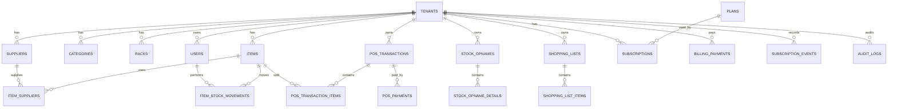

# Database Design Document (DDD)
# Smart POS & Manajemen Stok — SaaS Ritel Komoditas Padat SKU

## 1. Konvensi

- MySQL 8+.
- `BIGINT UNSIGNED AUTO_INCREMENT` sebagai PK.
- Table plural snake_case.
- Tenant-scoped table menggunakan `tenant_id`.
- Money `DECIMAL(15,2)`.
- Quantity `INT` untuk MVP.
- Transactional historical records immutable.
- Master tertentu dapat menggunakan soft delete.
- Semua FK menggunakan `ON DELETE CASCADE` untuk child tenant data sesuai purge policy.
- Tidak ada delete endpoint untuk historical records.

---

## 2. ERD Konseptual



---

## 3. Tables

### 3.1 `tenants`

| Column | Type | Rule |
|---|---|---|
| id | BIGINT UNSIGNED | PK |
| nama_toko | VARCHAR(255) | NOT NULL |
| slug | VARCHAR(255) | UNIQUE |
| operational_status | ENUM | `active`, `banned` |
| allow_negative_stock | BOOLEAN | DEFAULT false |
| dead_stock_days | INT | DEFAULT 90 |
| created_at | TIMESTAMP | |
| updated_at | TIMESTAMP | |

`operational_status` bukan status billing.

---

### 3.2 `users`

| Column | Type | Rule |
|---|---|---|
| id | BIGINT UNSIGNED | PK |
| tenant_id | BIGINT UNSIGNED | FK |
| name | VARCHAR(255) | NOT NULL |
| email | VARCHAR(255) | UNIQUE GLOBAL |
| no_hp | VARCHAR(20) | UNIQUE GLOBAL |
| password | VARCHAR(255) | NOT NULL |
| role | ENUM | `owner`, `staff` |
| two_factor_secret | TEXT | nullable |
| two_factor_confirmed_at | TIMESTAMP | nullable |
| created_at | TIMESTAMP | |
| updated_at | TIMESTAMP | |
| deleted_at | TIMESTAMP | nullable |

Trial abuse tidak hanya bergantung pada unique `no_hp`.

---

### 3.3 `admins`

| Column | Type | Rule |
|---|---|---|
| id | BIGINT UNSIGNED | PK |
| name | VARCHAR(255) | NOT NULL |
| email | VARCHAR(255) | UNIQUE |
| password | VARCHAR(255) | NOT NULL |
| role | ENUM | `super_admin`, `support` |
| two_factor_secret | TEXT | NOT NULL sebelum aktif |
| created_at | TIMESTAMP | |
| updated_at | TIMESTAMP | |

Tidak memiliki `tenant_id`.

---

### 3.4 `categories`

- id
- tenant_id
- kode
- nama
- timestamps

Unique:

`UNIQUE(tenant_id, kode)`.

---

### 3.5 `racks`

- id
- tenant_id
- kode
- nama
- lokasi
- timestamps

Unique:

`UNIQUE(tenant_id, kode)`.

---

### 3.6 `suppliers`

- id
- tenant_id
- nama
- kontak nullable
- alamat nullable
- timestamps

Unique:

`UNIQUE(tenant_id, nama)`.

---

### 3.7 `items`

| Column | Type | Rule |
|---|---|---|
| id | BIGINT UNSIGNED | PK |
| tenant_id | BIGINT UNSIGNED | FK |
| category_id | BIGINT UNSIGNED | FK |
| rack_id | BIGINT UNSIGNED | nullable FK |
| kode | VARCHAR(100) | NOT NULL |
| barcode | VARCHAR(255) | nullable |
| nama | VARCHAR(255) | NOT NULL |
| satuan | VARCHAR(50) | NOT NULL |
| harga_beli | DECIMAL(15,2) | ≥ 0 |
| average_cost | DECIMAL(15,2) | ≥ 0 |
| harga_jual | DECIMAL(15,2) | ≥ 0 |
| stok_saat_ini | INT | default 0 |
| stok_minimal | INT | ≥ 0 |
| threshold_mode | ENUM | `manual`, `auto_velocity` |
| lead_time_days | INT | ≥ 0 |
| safety_stock_days | INT | ≥ 0 |
| exp_date | DATE | nullable |
| movement_class | ENUM | `fast`, `normal`, `slow`, `dead` |
| is_active | BOOLEAN | default true |
| timestamps | | |
| deleted_at | TIMESTAMP | nullable |

Constraints:

- `UNIQUE(tenant_id, kode)`
- `UNIQUE(tenant_id, barcode)` dengan kebijakan nullable MySQL.
- `CHECK` untuk nilai non-negatif.

`average_cost` hanya diubah oleh stock movement Action yang relevan.

---

### 3.8 `item_suppliers`

| Column | Type | Rule |
|---|---|---|
| id | BIGINT UNSIGNED | PK |
| tenant_id | BIGINT UNSIGNED | FK |
| item_id | BIGINT UNSIGNED | FK |
| supplier_id | BIGINT UNSIGNED | FK |
| supplier_sku | VARCHAR(100) | nullable |
| harga_beli_terakhir | DECIMAL(15,2) | nullable |
| lead_time_days | INT | nullable |
| is_preferred | BOOLEAN | default false |
| timestamps | | |

Unique:

`UNIQUE(tenant_id, item_id, supplier_id)`.

Invariant:

> Maksimum satu preferred supplier aktif per item.

Invariant ini ditegakkan oleh Action + transaction + locking, bukan asumsi UI.

---

### 3.9 `item_stock_movements`

| Column | Type | Rule |
|---|---|---|
| id | BIGINT UNSIGNED | PK |
| tenant_id | BIGINT UNSIGNED | FK |
| item_id | BIGINT UNSIGNED | FK |
| user_id | BIGINT UNSIGNED | FK |
| supplier_id | BIGINT UNSIGNED | nullable FK |
| movement_type | ENUM | lihat daftar movement |
| qty | INT | > 0 |
| direction | ENUM | `in`, `out` |
| harga_satuan | DECIMAL(15,2) | nullable |
| note | TEXT | nullable |
| reference_type | VARCHAR(100) | nullable |
| reference_id | BIGINT UNSIGNED | nullable |
| created_at | TIMESTAMP | |

Movement type:

- `stock_in`
- `stock_out`
- `sale`
- `sale_void`
- `customer_return`
- `supplier_return`
- `damaged`
- `adjustment`
- `opname_adjustment`

**Insert-only. Tidak boleh UPDATE/DELETE.**

---

### 3.10 `pos_transactions`

| Column | Type | Rule |
|---|---|---|
| id | BIGINT UNSIGNED | PK |
| tenant_id | BIGINT UNSIGNED | FK |
| cashier_id | BIGINT UNSIGNED | FK |
| invoice_number | VARCHAR(255) | UNIQUE |
| status | ENUM | lihat state |
| subtotal_amount | DECIMAL(15,2) | server calculated |
| discount_amount | DECIMAL(15,2) | server calculated |
| total_amount | DECIMAL(15,2) | server calculated |
| idempotency_key | VARCHAR(255) | unique per tenant |
| completed_at | TIMESTAMP | nullable |

Checks:

- `partial` wajib memiliki `rack_id`; `full` wajib memiliki `rack_id = null`.
- `draft` memiliki `completed_at = null`; `completed` memiliki `completed_at` non-null.
| created_at | TIMESTAMP | |
| updated_at | TIMESTAMP | |

Status:

- `pending_payment`
- `completed`
- `failed`
- `expired`
- `refund_required`
- `voided`
- `partially_returned`
- `fully_returned`

---

### 3.11 `pos_transaction_items`

| Column | Type | Rule |
|---|---|---|
| id | BIGINT UNSIGNED | PK |
| tenant_id | BIGINT UNSIGNED | FK |
| pos_transaction_id | BIGINT UNSIGNED | FK |
| item_id | BIGINT UNSIGNED | FK |
| qty | INT | > 0 |
| returned_qty | INT | default 0 |
| harga_saat_transaksi | DECIMAL(15,2) | server snapshot |
| discount_amount | DECIMAL(15,2) | default 0 |
| subtotal_amount | DECIMAL(15,2) | server calculated |
| created_at | TIMESTAMP | |

`returned_qty <= qty`.

Historical transaction data immutable kecuali field operasional return yang memang merepresentasikan cumulative return state; histori return sendiri dicatat sebagai movement/audit.

---

### 3.12 `pos_payments`

Tabel khusus lifecycle uang POS.

| Column | Type | Rule |
|---|---|---|
| id | BIGINT UNSIGNED | PK |
| tenant_id | BIGINT UNSIGNED | FK |
| pos_transaction_id | BIGINT UNSIGNED | FK |
| method | ENUM | `cash`, `qris`, `transfer` |
| amount | DECIMAL(15,2) | > 0 |
| status | ENUM | lihat payment state |
| gateway_reference | VARCHAR(255) | nullable |
| confirmed_by | BIGINT UNSIGNED | nullable FK; wajib untuk `qris|transfer` |
| manual_reference | VARCHAR(255) | nullable |
| confirmation_note | TEXT | nullable |
| refunded_amount | DECIMAL(15,2) | default 0 |
| refunded_at | TIMESTAMP | nullable |
| refunded_by | BIGINT UNSIGNED | nullable FK |
| idempotency_key | VARCHAR(255) | nullable |
| paid_at | TIMESTAMP | nullable |
| created_at | TIMESTAMP | |
| updated_at | TIMESTAMP | |

Payment status:

- `pending`
- `paid`
- `failed`
- `refund_required`
- `partially_refunded`
- `refunded`

`qris|transfer` adalah payment manual non-tunai. Tidak ada metadata provider POS. `gateway_reference` tetap nullable untuk backward compatibility dan future delta.

`pending_payment` pada `pos_transactions` memiliki TTL default 24 jam. Boundary expiry bersifat inklusif terhadap `created_at`.

---

### 3.13 `stock_opnames`

| Column | Type | Rule |
|---|---|---|
| id | BIGINT UNSIGNED | PK |
| tenant_id | BIGINT UNSIGNED | FK |
| created_by | BIGINT UNSIGNED | FK |
| scope_type | ENUM | `partial`, `full` |
| rack_id | BIGINT UNSIGNED | nullable |
| status | ENUM | `draft`, `completed` |
| started_at | TIMESTAMP | |
| completed_at | TIMESTAMP | nullable |

---

### 3.14 `stock_opname_details`

| Column | Type | Rule |
|---|---|---|
| id | BIGINT UNSIGNED | PK |
| tenant_id | BIGINT UNSIGNED | FK |
| stock_opname_id | BIGINT UNSIGNED | FK |
| item_id | BIGINT UNSIGNED | FK |
| qty_sistem_at_count | INT | nullable sampai count |
| qty_fisik | INT | nullable sampai count |
| counted_at | TIMESTAMP | nullable |
| note | TEXT | nullable |
| created_at | TIMESTAMP | |
| updated_at | TIMESTAMP | |

Unique:

`UNIQUE(stock_opname_id, item_id)`.

Checks:

- `qty_fisik` nullable atau integer non-negatif.
- `qty_sistem_at_count`, `qty_fisik`, dan `counted_at` harus null atau non-null bersama.
- Snapshot dan `counted_at` pertama tidak berubah saat count dikoreksi.

---

### 3.15 `shopping_lists`

| Column | Type | Rule |
|---|---|---|
| id | BIGINT UNSIGNED | PK |
| tenant_id | BIGINT UNSIGNED | FK |
| created_by | BIGINT UNSIGNED | FK |
| status | ENUM | `draft`, `purchased`, `completed`, `archived` |
| created_at | TIMESTAMP | |
| submitted_at | TIMESTAMP | nullable |
| completed_at | TIMESTAMP | nullable |

---

### 3.16 `shopping_list_items`

- id
- tenant_id
- shopping_list_id
- item_id
- supplier_id nullable
- qty_disarankan
- qty_dibeli nullable
- qty_received default 0
- is_checked
- timestamps

---

### 3.17 `plans`

| Column | Type | Rule |
|---|---|---|
| id | BIGINT UNSIGNED | PK |
| name | VARCHAR(255) | |
| billing_interval | ENUM | `monthly`, `yearly` |
| price | DECIMAL(15,2) | ≥ 0 |
| is_trial | BOOLEAN | default false |
| trial_days | INT | nullable |
| is_active | BOOLEAN | default true |

---

### 3.18 `subscriptions`

| Column | Type | Rule |
|---|---|---|
| id | BIGINT UNSIGNED | PK |
| tenant_id | BIGINT UNSIGNED | FK |
| plan_id | BIGINT UNSIGNED | FK |
| status | ENUM | `trial`, `active`, `past_due`, `suspended`, `expired` |
| starts_at | TIMESTAMP | NOT NULL |
| ends_at | TIMESTAMP | NOT NULL |
| created_at | TIMESTAMP | |
| updated_at | TIMESTAMP | |

`ends_at` selalu terisi.

Trial invariant:

> tenant tidak boleh memiliki subscription trial baru jika histori tenant tersebut pernah memiliki subscription yang plan-nya `is_trial = true`.

---

### 3.19 `billing_payments`

Berbeda dari `pos_payments`.

| Column | Type | Rule |
|---|---|---|
| id | BIGINT UNSIGNED | PK |
| tenant_id | BIGINT UNSIGNED | FK |
| subscription_id | BIGINT UNSIGNED | FK |
| invoice_id | BIGINT UNSIGNED | nullable FK |
| amount | DECIMAL(15,2) | |
| status | ENUM | `pending`, `paid`, `failed`, `refunded` |
| provider | VARCHAR(50) | nullable pada MVP |
| provider_reference | VARCHAR(255) | nullable |
| paid_at | TIMESTAMP | nullable |
| created_at | TIMESTAMP | |
| updated_at | TIMESTAMP | |

---

### 3.20 `invoices`

Untuk billing SaaS, bukan invoice POS.

- id
- tenant_id
- subscription_id
- invoice_number unique
- amount
- due_at
- status: `open`, `paid`, `void`
- timestamps

---

### 3.21 `subscription_events`

Immutable event history:

- id
- tenant_id
- subscription_id
- event_type
- from_status nullable
- to_status nullable
- metadata JSON nullable
- actor_type
- actor_id nullable
- created_at

Tidak boleh update/delete.

---

### 3.22 `audit_logs`

- id
- tenant_id nullable untuk event admin global
- actor_type
- actor_id
- action
- subject_type
- subject_id
- old_values JSON nullable
- new_values JSON nullable
- ip_address
- user_agent nullable
- metadata JSON nullable
- created_at

Immutable bagi application user.

---

### 3.23 `tenant_deletion_requests`

| Column | Type | Rule |
|---|---|---|
| id | BIGINT UNSIGNED | PK |
| tenant_id | BIGINT UNSIGNED | FK |
| requested_by | BIGINT UNSIGNED | FK |
| status | ENUM | `requested`, `approved`, `rejected`, `queued`, `purged` |
| reason | TEXT | NOT NULL |
| approved_by | BIGINT UNSIGNED | nullable |
| approved_at | TIMESTAMP | nullable |
| purge_after | TIMESTAMP | nullable |
| created_at | TIMESTAMP | |
| updated_at | TIMESTAMP | |

---

### 3.24 `impersonation_sessions`

- id
- admin_id
- tenant_id
- target_user_id
- reason
- started_at
- expires_at
- ended_at nullable
- metadata
- timestamps

Impersonation wajib mempunyai expiration.

---

## 4. Foreign Key dan Tenant Integrity

Semua child tenant data memiliki FK ke tenant.

Ownership antar-relasi tenant-scoped ditegakkan di application layer melalui Ownership Guard.

Composite FK bukan mekanisme utama tenant isolation.

Purge tenant menggunakan:

```sql
DELETE FROM tenants WHERE id = ?
```

dengan `ON DELETE CASCADE`.

Purge hanya boleh dilakukan oleh scheduled purge command yang memeriksa status deletion request dan retention.

Tidak ada endpoint delete record transaksi individual.

---

## 5. Indexing

Minimum:

- `tenant_id`;
- `(tenant_id, created_at)`;
- `(tenant_id, item_id, created_at)`;
- `(tenant_id, barcode)`;
- `(tenant_id, kode)`;
- `(tenant_id, pos_transaction_id)`;
- `(tenant_id, stock_opname_id, item_id)`;
- `(tenant_id, subscription_id)`;
- `gateway_reference`.

Idempotency:

`UNIQUE(tenant_id, idempotency_key)` pada resource yang memang menggunakannya.

---

## 6. Data Retention

Historical records individual tidak dihapus.

Retention policy diterapkan pada tenant sebagai unit.

Purge hanya setelah:

- deletion request resmi disetujui atau retention otomatis terpenuhi;
- tenant tidak lagi membutuhkan active service;
- purge command melakukan final safety check.

Purge bersifat irreversible.

---

## 7. Database Invariants

1. `tenant_id` wajib untuk tenant-scoped records.
2. Stock movement immutable.
3. POS historical records tidak dihapus.
4. `returned_qty <= qty`.
5. Payment refunded amount tidak boleh melebihi payment amount.
6. Trial satu kali per owner/nomor HP.
7. Satu preferred supplier maksimum satu per item.
8. Opname detail satu item hanya satu kali per session.
9. `ends_at` subscription tidak null.
10. Stock mutation dan movement insert satu transaction.
11. Multi-item lock order berdasarkan ascending item ID.
12. Tenant purge hanya level tenant.
