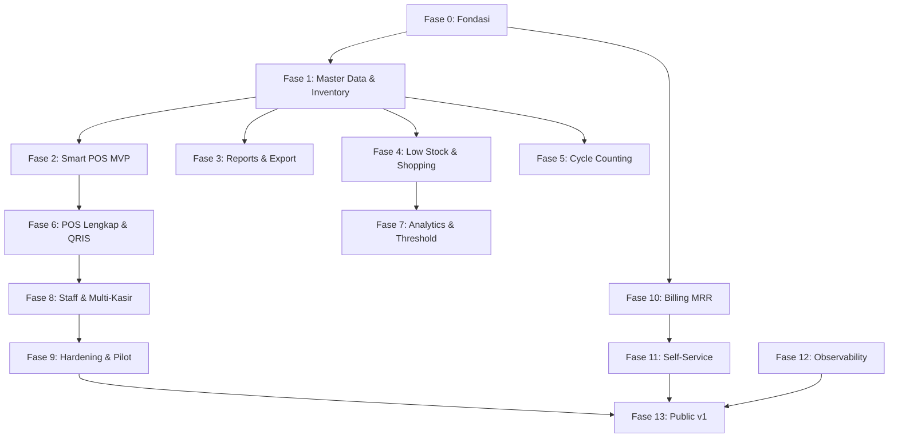

# Execution Plan — saas-contract-final-v1
# Smart POS & Manajemen Stok SaaS

---

## Keputusan Arsitektur (Terkunci)

| # | Keputusan | Pilihan |
|---|---|---|
| 1 | Urutan Eksekusi | **Hybrid**: core/backend sequential, UI + testing + docs paralel jika tanpa dependency |
| 2 | Docker Setup | **Laravel Sail** |
| 3 | UI Framework | **Hybrid terstruktur**: Filament → CRUD/admin; Custom Livewire/Blade → POS & workflow interaktif; **Design system yang sama** |
| 4 | Deployment Target | **VPS dengan Docker** |
| 5 | Codebase | **Fresh implementation** dari project Laravel baru |
| 6 | Database Development | **Migration-only**: semua perubahan schema wajib melalui Laravel migration |
| 7 | Frontend ↔ Backend | **Hybrid**: Livewire untuk sebagian besar UI; JSON endpoint untuk POS, webhook, dan integrasi |

---

## Dependency Graph & Parallelization



### Parallelization Rules

| Stream | Fase | Dependency |
|---|---|---|
| **Core Backend** (sequential) | 0 → 1 → 2 → 6 → 8 → 9 | Strict sequential |
| **Reports** (parallel setelah F1) | 3 | Butuh F1 (master data + movements) |
| **Shopping** (parallel setelah F1) | 4 | Butuh F1 (items + suppliers) |
| **Opname** (parallel setelah F1) | 5 | Butuh F1 (items + stock) |
| **Analytics** (parallel setelah F4) | 7 | Butuh F4 (threshold data) |
| **Billing** (parallel setelah F0) | 10 → 11 | Hanya butuh F0 (tenant + auth) |
| **Observability** (parallel) | 12 | Bisa kapan saja setelah core ada |

> [!TIP]
> Setelah Fase 1 selesai, Fase 2, 3, 4, dan 5 bisa berjalan **paralel** karena tidak saling bergantung. Begitu juga Fase 10 (Billing) bisa dimulai begitu Fase 0 selesai.

---

## Fase 0 — Fondasi

### 0.1 Environment Setup

| Task | Detail |
|---|---|
| Install PHP 8.3 + extensions | `apt install php8.3-cli php8.3-mysql php8.3-xml php8.3-curl php8.3-mbstring php8.3-zip php8.3-bcmath php8.3-redis` |
| Install Composer | Official installer |
| Install Node.js 20 LTS | Via nvm/nodesource |
| Create Laravel 12 project | `composer create-project laravel/laravel .` |
| Install & configure Sail | `php artisan sail:install` → MySQL, Redis, Mailpit |
| Boot Sail | `./vendor/bin/sail up -d` |
| Verify | `sail artisan --version`, `sail mysql`, `sail redis-cli ping` |

### 0.2 Multi-Tenant Foundation

#### [NEW] Migration: `tenants`
```
id, nama_toko, slug (unique),
operational_status ENUM('active','banned'), allow_negative_stock, dead_stock_days,
created_at, updated_at
```

#### [NEW] Migration: modify `users`
```
tenant_id (FK, required),
role ENUM('owner','staff'),
name, email (unique), no_hp (unique), password,
two_factor_secret, two_factor_confirmed_at, email_verified_at,
timestamps, softDeletes
```

Platform identity `super_admin|support` dipisahkan ke tabel/model `admins` tanpa `tenant_id`.

#### [NEW] Core Tenant Infrastructure
- `app/Models/Tenant.php` — model
- `app/Models/Concerns/HasTenantScope.php` — trait: auto-apply global scope + `creating` boot
- `app/Http/Middleware/SetTenantContext.php` — resolve dari `auth()->user()->tenant_id`
- `app/Services/TenantContext.php` — static accessor, **never** from request
- Register middleware di `bootstrap/app.php`

### 0.3 Auth & Authorization

#### [NEW] Sanctum Configuration
- API token auth untuk JSON endpoints (POS, webhook, integrasi)
- Session auth untuk Livewire/Filament pages

#### [NEW] Auth Actions
- `app/Actions/Auth/LoginAction.php`
- `app/Actions/Auth/LogoutAction.php`

#### [NEW] Authorization Layer
- `app/Enums/UserRole.php` — `owner`, `staff`; platform role memakai `AdminRole`
- `app/Policies/` — base policy convention
- Filament panel authorization via Filament's built-in policy system

### 0.4 OwnershipGuard

#### [NEW] `app/Support/OwnershipGuard.php`
```php
OwnershipGuard::forTenant($tenant, Category::class, $categoryId);
// Throws 403/404 if model doesn't belong to tenant
```
- Digunakan di setiap Action yang menerima external tenant-scoped ID
- Guard tidak menerima tenant_id dari request

### 0.5 Audit Foundation

#### [NEW] Migration: `audit_logs`
```
id, tenant_id (nullable), actor_type, actor_id, action,
subject_type, subject_id, old_values (JSON), new_values (JSON),
ip_address, user_agent, metadata (JSON), created_at
```

#### [NEW] Audit Infrastructure
- `app/Models/AuditLog.php` — **immutable** (no update/delete)
- `app/Actions/Audit/RecordAuditAction.php`
- Login/logout audit events

### 0.6 Design System Foundation

#### [NEW] Shared Design Tokens
- `resources/css/design-system.css` — color tokens, typography, spacing
- Primary: Indigo-600, Success: Emerald-500, Warning: Amber-500, Danger: Rose-600
- Font: Inter (Google Fonts)
- Light + Dark mode semantic tokens
- Shared antara Filament custom theme dan Livewire/Blade views

#### [NEW] Filament Panel Setup
- `app/Providers/Filament/AdminPanelProvider.php`
- Custom Filament theme menggunakan design tokens yang sama
- Tenant-aware panel

#### [NEW] Base Livewire Layout
- `resources/views/layouts/app.blade.php`
- Bottom navigation: Dashboard, Kasir, Barang, Stok, Belanja
- Mobile-first responsive shell

### 0.7 Testing Foundation

#### [NEW] Test Infrastructure
- Pest PHP setup (default Laravel 12)
- `tests/Concerns/HasTenantContext.php` — trait: create tenant + owner + auth
- `tests/Concerns/AssertsTenantIsolation.php` — reusable tenant isolation assertions
- CI config: GitHub Actions (or GitLab CI)

### Acceptance Criteria
- [ ] `sail up` berjalan, MySQL + Redis accessible
- [ ] `sail artisan migrate` reproducible
- [ ] Tenant context tersedia melalui authenticated user
- [ ] Request tanpa auth → 401
- [ ] Request ke tenant lain → 403/404
- [ ] Audit log tercatat saat login/logout
- [ ] Filament panel accessible untuk owner
- [ ] Design tokens konsisten antara Filament dan Blade

---

## Fase 1 — Master Data & Inventory Ledger

### 1.1 Database Migrations

| Table | Key Columns |
|---|---|
| `categories` | tenant_id, kode (unique/tenant), nama |
| `racks` | tenant_id, kode (unique/tenant), nama, lokasi |
| `suppliers` | tenant_id, nama (unique/tenant), kontak, alamat |
| `items` | tenant_id, category_id, rack_id nullable, kode/barcode unique per tenant, prices, stock, threshold fields, exp_date, movement_class, is_active, softDeletes |
| `item_suppliers` | tenant_id, item_id, supplier_id, supplier_sku, harga_beli_terakhir, lead_time_days, is_preferred, UNIQUE(tenant_id,item_id,supplier_id) |
| `item_stock_movements` | tenant_id, item_id, user_id, supplier_id nullable, movement_type canonical, qty, direction, harga_satuan, reference_type/id, note, created_at -- IMMUTABLE |

### 1.2 Models
- All models extend base with `HasTenantScope`
- `StockMovement` rejects every update and delete

### 1.3 Actions (Backend Sequential)

| Action | Key Rules |
|---|---|
| `CreateItemAction` | Validate unique kode/tenant, ownership guard category_id & rack_id |
| `StockInAction` | DB transaction, `lockForUpdate()`, MAC recalculation, create movement |
| `StockOutAction` | DB transaction, `lockForUpdate()`, average_cost stays, create movement |
| `AdjustStockAction` | DB transaction, `lockForUpdate()`, reason required, create movement |
| `SetPreferredSupplierAction` | DB transaction, lock item, unset all preferred, set target, max-1 invariant |

**MAC Formula (Stock In):**
```
new_avg = ((old_stock × old_avg) + (in_qty × in_cost)) / (old_stock + in_qty)
// Jika old_stock == 0 → new_avg = in_cost
```

**Multi-item lock order:** Sort by `item_id ASC` sebelum `lockForUpdate()`.

### 1.4 JSON API Endpoints

| Method | Path | Notes |
|---|---|---|
| GET | `/api/v1/items` | search, filter, pagination |
| GET | `/api/v1/items/scan/{barcode}` | POS optimized lookup |
| POST | `/api/v1/stock/movements/in` | StockInAction |
| POST | `/api/v1/stock/movements/out` | StockOutAction |
| POST | `/api/v1/stock/movements/adjustment` | AdjustStockAction |
| GET/POST | `/api/v1/items/{id}/suppliers` | tenant ownership + preferred supplier |
| PUT/DELETE | `/api/v1/item-suppliers/{id}` | Action + audit |

### 1.5 Filament Resources (Parallel — UI)

| Resource | Features |
|---|---|
| `CategoryResource` | CRUD, tenant-scoped |
| `RackResource` | CRUD, tenant-scoped |
| `SupplierResource` | CRUD, tenant-scoped |
| `ItemResource` | create/edit/deactivate only, supplier management, stock movement history view; no hard delete |
| `StockMovementResource` | Read-only list, filterable |

### 1.6 Tests (Parallel — Testing)

| Test | Type |
|---|---|
| Tenant isolation (all models) | Security |
| Ownership violation | Security |
| Stock race condition (concurrent stock-in) | Concurrency |
| Multi-item lock ordering | Concurrency |
| MAC calculation (stock in, zero-stock, stock out) | Unit |
| Preferred supplier concurrency | Concurrency |

### Acceptance
- [ ] Tenant A tidak bisa akses data Tenant B
- [ ] FK tenant-scoped dari tenant lain → 403/404
- [ ] Concurrent stock mutation aman
- [ ] MAC calculation benar untuk semua edge case
- [ ] Max 1 preferred supplier terjamin
- [ ] **Tidak ada UI yang mengubah `stok_saat_ini` langsung**

---

## Fase 2 — Smart POS MVP (Cash Only)

### 2.1 Database Migrations

| Table | Key Columns |
|---|---|
| `pos_transactions` | tenant_id, user_id, transaction_number, status ENUM, subtotal_amount, discount_amount, total_amount, idempotency_key, UNIQUE(tenant_id, idempotency_key) |
| `pos_transaction_items` | tenant_id, pos_transaction_id, item_id, qty, returned_qty (default 0), harga_saat_transaksi, discount_amount, subtotal_amount |

### 2.2 Actions (Backend Sequential)

| Action | Sequence |
|---|---|
| `CheckoutPosAction` | Validate ownership → load items → sort IDs → lock rows → validate active + stock → server calculate → create transaction + items → commit. **No stock reduction yet.** |
| `PayCashAction` | Lock transaction → lock item IDs ascending → revalidate stock → insert sale movements → decrement stock → create pos_payment(cash, paid) → transaction=completed → commit |

### 2.3 JSON API Endpoints

| Method | Path | Header |
|---|---|---|
| POST | `/api/v1/pos/checkout` | `Idempotency-Key` required |
| POST | `/api/v1/pos/transactions/{id}/pay-cash` | |
| GET | `/api/v1/pos/transactions/{id}/status` | |

### 2.4 Custom Livewire POS UI (Parallel — UI)

> POS menggunakan **custom Livewire/Blade**, bukan Filament, karena butuh workflow interaktif yang sangat cepat.

| Component | Features |
|---|---|
| `PosScreen` | Main POS layout, mobile-first |
| `BarcodeScanner` | Input field + camera scan, duplicate scan = qty++ |
| `CartManager` | Real-time cart, qty edit, line discount, hapus item |
| `CashPayment` | Input cash received, hitung kembalian, konfirmasi |
| `TransactionReceipt` | Basic receipt, print dialog |
| `PosHistory` | Transaction list (Filament table component reuse) |

**Keyboard shortcuts**: F1=scan, F2=pay, Esc=cancel

### 2.5 Tests

| Test | Assertion |
|---|---|
| Concurrent sale | 2 users sell same item → stock consistent |
| Duplicate checkout (idempotency) | Same key → same transaction, no duplicate |
| Stock negatif | Stock insufficient → failed, bukan negatif |
| Immutable history | Completed transaction cannot be modified |
| Server-side calculation | Client total ignored, server recalculates |

### MVP Release Gate
- Owner-only (no staff yet)
- Billing admin-managed
- Tenant onboarding manual

---

## Fase 3 — Reports & Export *(Parallel setelah F1)*

### Deliverables
- Stock report Livewire page (tenant-scoped)
- Movement history report dengan filter date/item/type
- POS transaction history
- PDF export via DomPDF
- Excel export via PhpSpreadsheet queued ke private storage
- Print support (print dialog)
- **Staff visibility restriction**: staff tidak melihat harga_beli, average_cost, margin, profit

---

## Fase 4 — Low Stock & Shopping *(Parallel setelah F1)*

### Deliverables
- Low stock alert dashboard widget
- `shopping_lists` status draft/purchased/completed/archived dan `shopping_list_items` dengan supplier_id, qty_disarankan, qty_dibeli, qty_received, is_checked
- `GenerateShoppingListAction` — items where `stok_saat_ini <= stok_minimal`, preferred supplier only, null if none
- `SubmitShoppingListAction`: draft -> purchased; setiap item terpilih wajib supplier dan qty_dibeli > 0
- `ReceiveShoppingListAction`: purchased -> completed, one-time, lock list/items ascending, seluruh qty aktual wajib
- Shopping list Filament resource
- Receive workflow Livewire component

---

## Fase 5 — Cycle Counting *(Parallel setelah F1)*

### Deliverables
- `stock_opnames` + `stock_opname_details` migrations
- Scope conflict validation: partial same rack no overlap, full vs partial no overlap, different rack parallel OK
- Time-aware snapshot: `qty_sistem_at_count` captured saat item dihitung (bukan saat session dibuat)
- Finalize: validate semua counted → lock items ascending → delta adjustment → movement creation
- Custom Livewire counting UI (scanner + physical qty input + save & next)
- Finalize confirmation + result summary

---

## Fase 6 — Smart POS Lengkap & QRIS

### Deliverables
- Perluas baseline `pos_payments` Fase 2 untuk QRIS, gateway lifecycle, dan refund behavior
- Midtrans QRIS integration
- `GenerateQrisAction` — idempotent, reuse active QR
- `HandleMidtransWebhookAction` — signature verify, idempotent, duplicate/out-of-order safe
- `FinalizePosTransactionAction` — revalidate stock → completed or refund_required
- `VoidTransactionAction` — reversal movements, cash/QRIS refund obligation
- `PartialReturnAction` — validate returned_qty ≤ sold qty, customer_return movements
- `MarkRefundedAction` — manual owner refund marking
- QRIS payment UI in POS (QR display, polling status, timeout handling)
- Web Bluetooth print + fallback print dialog
- 8 release blocker tests

---

## Fase 7 — Analytics & Smart Threshold *(Parallel setelah F4)*

### Deliverables
- 30-day movement SMA calculation
- Fast/slow/dead stock classification
- Smart Threshold: `ceil(avg_daily_out × (lead_time + safety_stock))`
- `POST /api/v1/items/{id}/smart-threshold`
- Dashboard recommendation widgets
- All calculations unit tested without DB

---

## Fase 8 — Staff & Multi-Kasir

### Deliverables
- Staff creation/invitation workflow
- Staff policies: **CANNOT** access purchase cost, margin, inventory value, profit, billing, staff management
- Staff **CAN** operate POS
- Concurrent POS sessions support
- Role visibility tests for all UI surfaces

---

## Fase 9 — Hardening & Pilot

### Deliverables
- Load tests (k6/Artillery): concurrent stock, POS checkout, webhook flood
- Security review checklist execution
- Backup/restore verification
- Browser/device matrix testing
- Pilot deployment to VPS
- Support workflow documentation
- **Exit criteria**: No unresolved P0 security/data/financial issue

---

## Fase 10 — Billing MRR & Admin Pusat *(Parallel setelah F0)*

### Deliverables
- `plans`, `subscriptions`, `invoices`, `billing_payments`, `subscription_events` migrations
- Subscription state machine: trial → active → past_due → suspended → expired
- `CreateSubscriptionAction` with trial invariant (1 trial/phone lifetime)
- Invoice generation
- Manual payment verification workflow
- Filament admin panel: tenant management, subscription management
- `impersonation_sessions` + `tenant_deletion_requests` migrations
- Impersonation workflow with audit + UI banner
- `PurgeTenantCommand` with safety checks + `ON DELETE CASCADE`

---

## Fase 11 — Self-Service Onboarding & Automated Billing

### Deliverables
- `POST /api/v1/auth/register` + OTP verification
- Auto trial creation (14 days)
- Trial abuse prevention (phone + subscription history check)
- Midtrans billing integration
- `POST /api/v1/webhooks/midtrans-billing` (separate dari POS webhook)
- Automatic subscription activation on payment confirmation

---

## Fase 12 — Observability

### Deliverables
- Laravel Telescope (local/staging)
- Horizon dashboard (queue monitoring)
- Webhook failure monitoring + alerting
- Scheduled backup verification
- Audit review admin page

---

## Fase 13 — Public v1

### Gate
Semua fase lulus acceptance criteria + testing contract.

### Deliverables
- Final security audit
- Production VPS Docker deployment
- Docker Compose production config
- SSL/domain setup
- Documentation
- Monitoring active

---

## Tech Stack Summary

| Layer | Technology |
|---|---|
| Framework | Laravel 12 |
| PHP | 8.3+ |
| Database | MySQL 8+ (via Sail) |
| Cache/Queue | Redis (via Sail) |
| Auth | Sanctum (token + session) |
| Admin/CRUD UI | Filament 3 |
| Interactive UI | Custom Livewire 3 + Blade |
| Design System | Shared CSS tokens (Indigo/Emerald/Amber/Rose + Inter font) |
| CSS | Tailwind CSS (Filament default) + custom design tokens |
| POS API | JSON endpoints via Sanctum token |
| Webhook | JSON endpoints, no auth token, signature verify |
| PDF | DomPDF |
| Excel | Laravel Excel |
| Payment Gateway | Midtrans (QRIS) |
| Print | Web Bluetooth + print dialog fallback |
| Queue | Laravel Horizon |
| Testing | Pest PHP |
| Local Dev | Laravel Sail (Docker) |
| Production | VPS + Docker Compose |
| CI | GitHub Actions |

---

## Execution Start

Setelah approval, eksekusi dimulai dari **Fase 0** dengan urutan:

```
0.1 Environment Setup (PHP, Composer, Node, Laravel, Sail)
0.2 Multi-Tenant Foundation
0.3 Auth & Authorization
0.4 OwnershipGuard
0.5 Audit Foundation
0.6 Design System Foundation
0.7 Testing Foundation
→ Verify all acceptance criteria
→ Proceed to Fase 1
```

## Verification Plan

### Per Fase
```bash
# Full test suite
sail artisan test

# Specific groups
sail artisan test --filter=TenantIsolation
sail artisan test --filter=OwnershipGuard
sail artisan test --filter=StockRace
sail artisan test --filter=PosIdempotency
```

### Manual
- Demo walkthrough setiap akhir fase
- POS flow verified pada mobile viewport
- Concurrent operations proven via tests

## Repair Gate Fase 0-4

Fase 5 tidak boleh dimulai sebelum acceptance dan testing contract Fase 0-4 lulus.

### Cross-Reference Checklist

| Area | Fase 0 | Fase 1 | Fase 2 | Fase 3 | Fase 4 |
|---|---|---|---|---|---|
| PRD/Blueprint | tenant/auth/audit | master/ledger | cash POS | reports | low-stock/shopping |
| DDD | tenant/user/admin/audit | master + movement | POS + payment | no core table baru | shopping |
| SAD | tenant context/audit | stock/supplier lock | checkout/pay cash | reporting job | generate/submit/receive |
| API | auth + `/api/v1` | items/stock/suppliers | POS cash | export | shopping lists |
| UI/UX | owner panel/tokens | movement-only UI | scanner/cart/payment | filter/progress/role | actionable low-stock |
| Tests | tenant/auth/audit | isolation/concurrency | idempotency/payment | tenant/role/export | lifecycle/concurrency |

### Deferred Contract

- Fase 5: stock opname.
- Fase 6: QRIS, webhook, void, return, refund.
- Fase 7: analytics dan Smart Threshold.
- Fase 8: aktivasi Staff dan multi-kasir.
- Fase 10+: billing, platform admin, impersonation, deletion.

### Repair Decisions

- Runtime Laravel 12 / PHP 8.3.
- Database dibackup lalu di-reset.
- `pos_payments` dasar berada pada Fase 2.
- FK tenant cascade; relasi historis restrict/null.
- Shopping List memakai supplier per item dan status canonical.
- Operational status tenant hanya `active|banned`.

### Definition of Done

Fresh migration, test contract, tenant/policy fail-closed, concurrency test, API/UI sync, audit, dan dokumentasi harus lulus sebelum checkbox fase diaktifkan.


## Repair Execution Result - 2026-08-11

Status: implementation Fase 0-4 selesai secara kode; automated gate dan runtime Sail lulus. Checkbox fase tetap tidak dicentang sampai visual walkthrough dan satu run CI remote di bawah lulus.

### Backup evidence

- `repair-backups/20260811/database-before-repair.sql`
  - SHA-256: `52bd1096e9b5d29d045af17025b936a041136f04333f3c4415e3f4143fe082b2`
- `repair-backups/20260811/source-before-repair.tar.gz`
  - SHA-256: `40a0b7dc1b7ed7b785516b40255c7f22ca27952bc2922d1d5bbd6cef74116bb4`
- Folder backup masuk `.gitignore` agar dump lokal tidak ikut ter-commit.

### Automated gate passed

- Runtime test: PHP 8.3.33 CLI WSL + MySQL 8.4.
- `migrate:fresh --seed --force`: lulus; seeder hanya tenant demo dan Owner.
- Pest: 44 tests, 202 assertions, seluruhnya lulus.
- True multi-process concurrency: checkout idempotency, Pay Cash, preferred supplier, dan Shopping List receive lulus.
- `composer validate --strict` dan `composer check-platform-reqs`: lulus.
- Laravel Pint: 169 files lulus.
- Vite production build: lulus tanpa warning.
- Blade cache: lulus.
- Route audit: 23 endpoint `/api/v1`; tidak ada create/edit route untuk histori; Report Export progress page tersedia.
- Static mutation audit: controller/Livewire/Filament tidak melakukan mutation model langsung; hard-delete/bulk-delete histori tidak tersedia.
- Automated Owner/Staff HTTP contract: Owner dapat membuka POS/report workflow; Staff mendapat 403; private export lintas tenant mendapat 404.
- Custom Filament theme dan Blade memakai semantic token yang sama; build tema terpisah lulus tanpa warning.
- POS receipt serta report stok/movement/POS menyediakan print action yang diuji.

### Runtime Sail closed — 2026-08-15

- Image `sail-8.3/app` (`a36809295b86`) berhasil dibangun dan menjalankan PHP 8.3.33 serta Node.js 20.20.2.
- `laravel.test`, dedicated Redis queue worker, MySQL 8.4, Redis, dan Mailpit berjalan melalui Compose.
- Fresh migration/seed MySQL `testing` dan seluruh 44 test/202 assertion lulus dari dalam Sail.
- `/admin/login` dan custom Filament theme menghasilkan HTTP 200 dari container; request `/api/v1/items` tanpa token menghasilkan 401.
- Server Sail memakai `artisan serve --no-reload` agar override `DB_HOST=mysql` dan `REDIS_HOST=redis` diteruskan ke child PHP server, sementara CLI WSL tetap memakai `127.0.0.1`.

### Gate still open

1. Walkthrough visual desktop/mobile Owner dan Staff belum dapat dijalankan karena browser in-app tidak terhubung (`No browser is available`). Contract HTTP/render sudah diuji otomatis, tetapi screenshot/evidence visual tetap wajib.

2. Workflow `.github/workflows/ci.yml` sudah tersedia untuk PHP 8.3/Node 20/MySQL/Redis/build, tetapi belum dapat dibuktikan melalui run remote karena workspace belum memiliki repository remote.

Fase 5 tetap dibekukan. Fase 0-4 baru boleh dicentang setelah dua gate eksternal di atas ditutup.

### Runtime hostname correction - 2026-08-12

- CLI WSL (`php artisan serve`) memakai `DB_HOST`, `REDIS_HOST`, dan `MAIL_HOST` = `127.0.0.1` karena service Docker dipublikasikan ke host.
- Service `laravel.test` mendapat override Compose `mysql`, `redis`, dan `mailpit`, sehingga konfigurasi tetap valid di jaringan internal Sail.
- MySQL dinyalakan kembali, cache Laravel dibersihkan, seluruh migration terdeteksi, dan `GET http://127.0.0.1:8000` terverifikasi `200`.
