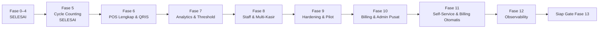

# Master Plan Fase 5–12
# Smart POS & Manajemen Stok SaaS

Status dokumen: **DISETUJUI UNTUK MENJADI ACUAN EKSEKUSI**

Tanggal baseline: **15 Agustus 2026**

Baseline aplikasi: **Fase 0–4 selesai; gate lokal, visual, dan CI lulus**

---

## 1. Tujuan dan Batas Master Plan

Dokumen ini menjadi rencana induk pelaksanaan Fase 5 sampai Fase 12. Implementasi tetap dilakukan **satu fase per satu fase**, bukan sebagai satu perubahan besar, agar setiap domain dapat diverifikasi dan ditutup sebelum dependency berikutnya dimulai.

Master plan ini:

- tidak mengubah kontrak produk yang sudah disetujui;
- menguraikan dependency, deliverable, pengujian, visual gate, dan exit criteria;
- mengunci urutan eksekusi utama `F5 → F6 → F7 → F8 → F9 → F10 → F11 → F12`;
- mewajibkan Document Delta sebelum coding jika ditemukan schema, enum, endpoint, business rule, permission, atau UI state baru;
- tidak mencakup Fase 13/Public v1.

Source of truth tetap mengikuti urutan:

1. `prd-saas-manajemen-stok.md`
2. `blueprint-saas-stok.md`
3. `database-design-document.md`
4. `software-architecture-document.md`
5. `api-specification.md`
6. `ui-ux-specification.md`
7. `development-roadmap.md`
8. `.agents/AGENTS.md`

---

## 2. Strategi Eksekusi

### 2.1 Urutan delivery



Secara arsitektur Fase 5, 7, 10, dan baseline observability dapat dimulai lebih awal sesuai dependency graph lama. Untuk eksekusi repository ini, perubahan bisnis tetap ditutup secara berurutan. Instrumentasi minimum boleh ditambahkan bersama setiap fase, tetapi Fase 12 baru ditutup setelah seluruh workflow Fase 5–11 dapat dimonitor.

### 2.2 Siklus wajib setiap fase

Setiap fase mengikuti siklus yang sama:

1. Audit kontrak dan kode aktual.
2. Buat implementation plan fase dan cross-reference source of truth.
3. Nyatakan Document Delta jika ada kontrak yang belum cukup atau berubah.
4. Implementasi migration/domain/Action/API/UI sesuai dependency.
5. Jalankan unit, feature, integration, concurrency, dan security test yang relevan.
6. Jalankan quality gate penuh.
7. Lakukan walkthrough desktop/mobile serta simpan screenshot/evidence.
8. Perbarui dokumentasi dan checklist fase.
9. Commit dan push satu increment yang dapat dipulihkan.
10. Tutup fase hanya setelah CI remote lulus.

### 2.3 Quality gate minimum

Per fase, minimum berikut harus lulus:

```text
php artisan migrate:fresh --seed --force
php artisan test
vendor/bin/pint --test
composer validate --strict
composer check-platform-reqs
npm run build
php artisan view:cache
php artisan route:list
```

Tambahkan test concurrency multi-process, integration provider, load test, atau restore test sesuai fase. Tidak semua fase boleh hanya mengandalkan test HTTP biasa.

### 2.4 Definition of Done global

Sebuah fase dinyatakan selesai hanya jika:

- migration fresh dan migration upgrade dari baseline yang didukung lulus;
- tenant isolation dan ownership guard fail-closed;
- mutation bisnis hanya melalui Action;
- stock/payment/subscription state transition bersifat legal dan auditable;
- endpoint dan UI tidak membuat business rule sendiri;
- loading, empty, success, error, permission, dan critical confirmation state tersedia;
- desktop dan mobile walkthrough lulus;
- test suite, build, static checks, dan CI remote hijau;
- evidence serta dokumen fase diperbarui;
- tidak ada blocker severity P0 yang terbuka.

---

## 3. Dependency dan Cross-Reference

| Fase | Dependency kode | Kontrak utama | Status awal |
|---|---|---|---|
| 5 | Item, rack, stock ledger F1 | PRD 6.8; Blueprint 15; DDD 3.13–3.14; SAD 5.5/13; API 8; UI 22/68 | Siap direncanakan |
| 6 | POS cash F2 dan ledger F1 | PRD 6.3–6.6; Blueprint 9–11; DDD 3.10–3.12; SAD 5.1–10; API 5–6; UI 23–33/66 | Setelah F5 |
| 7 | Movement F1, Shopping F4 | PRD 5.1; Blueprint 13; DDD item analytics fields; API 4; UI 12; Roadmap F7 | Setelah F6 |
| 8 | Panel tenant F0 dan POS F6 | PRD 4.2; Blueprint 4; SAD 17; UI 11/40/42; Roadmap F8 | Setelah F7 |
| 9 | Workflow operasional F5–F8 | PRD 9–11; SAD 18–19; UI 64–65; Roadmap F9 | Setelah F8 |
| 10 | Panel platform F0 | PRD 4.3/7/9; Blueprint 17–19; DDD 3.17–3.24; SAD 5.3/14–17; API 11–13; UI 41–44 | Setelah F9 |
| 11 | Billing/admin F10 | PRD 7 v1; Blueprint 17; DDD billing tables; SAD 5.3/14; API 3/11; UI 39–41 | Setelah F10 |
| 12 | Queue/webhook/audit F5–F11 | PRD 9/11; Blueprint 21–22; SAD 18–19; Roadmap F12 | Setelah F11 |

---

## 4. Contract Decision Gates

Empat area belum memiliki detail yang cukup untuk diimplementasikan tanpa keputusan eksplisit. Keempatnya tidak menghalangi pembuatan master plan, tetapi wajib ditutup sebelum coding fase terkait.

| Gate | Kekosongan kontrak | Tindakan wajib |
|---|---|---|
| CD-6.1 | DDD belum mengunci bentuk penyimpanan metadata QR aktif/kedaluwarsa dan referensi QR lama | Audit schema aktual; ajukan Document Delta untuk kolom provider atau tabel payment attempt jika dibutuhkan |
| CD-7.1 | Batas numerik klasifikasi `fast`, `normal`, `slow`, `dead` dan jenis movement yang dihitung belum eksplisit | Ajukan Document Delta yang menetapkan algoritme deterministik; `tenant.dead_stock_days` tetap menjadi input dead stock |
| CD-10.1 | Capability matrix subscription `trial/active/past_due/suspended/expired` diwajibkan tetapi belum dirinci | Ajukan matrix read/write/login/billing yang eksplisit tanpa mencampur `tenants.operational_status` |
| CD-11.1 | Provider, expiry, retry, attempt limit, rate limit, dan penyimpanan OTP belum dikunci | Ajukan Document Delta keamanan OTP; jangan menambah tabel/endpoint di luar API contract tanpa persetujuan |

Semua mapping event Midtrans juga harus dibekukan terhadap dokumentasi provider yang berlaku saat fase dijalankan. Secret provider tidak boleh disimpan di repository atau evidence.

---

## 5. Fase 5 — Cycle Counting

### 5.1 Sasaran

Menyediakan stock opname parsial per rak dan full count yang tetap konsisten saat transaksi stok normal terus berjalan.

### 5.2 Deliverable

**Schema dan domain**

- Migration `stock_opnames` sesuai DDD: tenant, creator, `partial|full`, rack nullable, `draft|completed`, started/completed timestamps.
- Migration `stock_opname_details`: tenant, opname, item, `qty_sistem_at_count`, `qty_fisik`, `counted_at`, note, serta unique `(stock_opname_id, item_id)`.
- Enum/cast/state transition yang hanya mengizinkan `draft → completed`.
- Tidak ada edit detail setelah completed dan tidak ada hard delete histori completed.

**Action dan concurrency**

- `CreateOpnameAction` memvalidasi tenant, scope, rack, dan konflik session aktif.
- Partial rack berbeda boleh paralel; partial pada rack sama ditolak.
- Full count bertabrakan dengan seluruh partial/full aktif, dan sebaliknya.
- Detail dibuat hanya untuk item dalam scope tenant yang valid.
- Saat item dihitung, lock item/detail lalu simpan snapshot `qty_sistem_at_count` dari stok saat itu—bukan saat session dibuat.
- Finalize memvalidasi semua detail sudah dihitung, mengurutkan item ID, mengunci row, menghitung `delta = qty_fisik - qty_sistem_at_count`, membuat movement `opname_adjustment`, lalu menerapkan delta ke stok **terkini**.
- Movement tetap immutable; transaksi stok normal tidak diblokir selama seluruh durasi opname.

**API dan UI**

- `POST /api/v1/opname` untuk partial/full.
- `GET /api/v1/opname` tenant-scoped.
- `PUT /api/v1/opname/{id}/details` untuk save count.
- `POST /api/v1/opname/{id}/finalize` untuk finalization.
- Livewire counting workflow: pilih scope, scanner/search, physical quantity dominan, Save & Next, progress, discrepancy review, confirmation, dan result summary.
- Loading/error/empty/completed states serta responsive desktop/mobile.

### 5.3 Test matrix wajib

- Tenant A tidak dapat membaca/mengubah opname Tenant B.
- Partial rack A dan rack B dapat berjalan bersamaan.
- Dua partial pada rack sama: tepat satu yang berhasil.
- Full vs partial dan full vs full ditolak secara konsisten.
- Snapshot baru dibuat saat tiap item dihitung.
- Movement setelah count tetapi sebelum finalize tetap menghasilkan time-aware reconciliation yang benar.
- Finalize ditolak jika satu detail belum dihitung.
- Duplicate/retry finalize tidak membuat movement kedua.
- Lock item selalu ascending untuk multi-item finalize.
- Completed opname tidak dapat diedit atau difinalisasi ulang.

### 5.4 Visual gate

- Desktop: create, count, review, confirmation, completed summary.
- Mobile: scan/search, numeric input, Save & Next, progress, discrepancy.
- Error: conflict scope, uncounted detail, stale/duplicate finalize.
- Evidence disimpan di `docs/evidence/f5-cycle-counting-YYYY-MM-DD/`.

### 5.5 Exit checklist

- [x] Schema dan invariant F5 lulus.
- [x] Concurrency dan time-aware test lulus.
- [x] API dan UI contract lulus.
- [x] Visual evidence desktop/mobile lengkap.
- [x] Full quality gate dan CI remote hijau.
- [x] Fase 5 ditandai selesai di execution plan.

---

## 6. Fase 6 — Smart POS Lengkap & QRIS

### 6.1 Sasaran

Melengkapi POS dengan QRIS Midtrans, reconciliation tanpa stock reservation, lifecycle payment terpisah, void, partial return, manual refund, dan print fallback yang aman.

### 6.2 Entry gate

- Fase 5 selesai.
- Akun dan credential Midtrans sandbox tersedia melalui environment.
- CD-6.1 selesai jika schema baseline tidak dapat menyimpan seluruh riwayat QR/reference yang diperlukan.
- Webhook sandbox dapat mencapai environment pengujian atau tersedia fixture integration yang setara.

### 6.3 Deliverable

**Payment domain**

- Lengkapi `pos_payments` sesuai DDD tanpa mencampurnya dengan `billing_payments`.
- Pertahankan transaction lifecycle dan payment lifecycle sebagai dua state machine terpisah.
- `GenerateQrisAction`: idempotency key, reuse QR aktif, replace QR expired, unique gateway reference, dan tetap dapat merekonsiliasi late webhook.
- Adapter/service Midtrans menjadi satu-satunya boundary komunikasi provider.
- `HandleMidtransWebhookAction`: signature verification, provider reference resolution, duplicate-safe, out-of-order-safe, dan state validation sebelum mutation.
- `FinalizePosTransactionAction`: lock transaction, lock item ascending, revalidate stock, lalu `completed` atau `refund_required`.
- Tidak ada stock reservation ketika QR dibuat.

**Void, return, refund**

- `VoidTransactionAction`: hanya state legal, tidak ada return terdahulu, reversal movement, dan payment obligation sesuai cash/QRIS.
- `PartialReturnAction`: berbasis transaksi asli, cumulative returned quantity tidak melebihi sold quantity, customer-return movement, refund amount dari net line amount.
- `MarkRefundedAction`: Owner-only, actor/timestamp/note tercatat, total refunded tidak melebihi payment amount.
- Refund v1 tetap manual; aplikasi tidak memanggil automated refund Midtrans.

**API dan UI**

- Generate QR, poll/check status, webhook POS Midtrans, void, return, dan mark-refunded sesuai API specification.
- UI QRIS memiliki state: creating, QR ready, waiting, timeout/network unknown, paid/finalizing, completed, dan refund required.
- Network failure menawarkan “Periksa Status Pembayaran”, bukan membuat pembayaran baru.
- Refund-required tidak menawarkan “Bayar Lagi”.
- Void, return, dan mark refunded memakai confirmation yang menjelaskan konsekuensi.
- Web Bluetooth printing jika didukung; fallback ke print dialog/PDF bila tidak didukung atau gagal.

### 6.4 Release-blocker tests

Seluruh delapan skenario roadmap harus lulus:

1. Customer membayar dan stok tersedia → transaction completed.
2. Customer membayar dan stok sudah berkurang → transaction/payment refund_required.
3. Webhook sama dua kali → hanya satu sale movement.
4. Paid webhook datang setelah local expiry → reconciliation tanpa duplicate sale.
5. Retry generate QR → QR/payment attempt aktif yang sama.
6. Completed QRIS lalu void → refund obligation tercatat.
7. Partial return QRIS → partial refund obligation sesuai net line amount.
8. Bluetooth tidak didukung → print dialog fallback tersedia.

Tambahan wajib:

- invalid signature ditolak tanpa mutation;
- out-of-order paid/expired tidak melakukan illegal transition;
- cross-tenant transaction/payment ID menghasilkan 404;
- concurrent webhook/void/return aman terhadap duplicate movement;
- refunded amount invariant lulus;
- UI tidak pernah menganggap QR tampil sebagai payment success.

### 6.5 Visual/runtime gate

- Jalankan QRIS sandbox end-to-end bila credential tersedia.
- Walkthrough desktop dan mobile untuk success, timeout, retry status, stock conflict, manual refund, return, void, receipt.
- Uji browser dengan dan tanpa Web Bluetooth.
- Sanitasi seluruh evidence dari token, signature, nomor sensitif, dan secret.
- Evidence disimpan di `docs/evidence/f6-qris-pos-YYYY-MM-DD/`.

### 6.6 Exit checklist

- [ ] CD-6.1 ditutup bila diperlukan.
- [ ] Delapan release-blocker tests lulus.
- [ ] Integration/security/concurrency tests lulus.
- [ ] QRIS sandbox dan print fallback terverifikasi.
- [ ] Visual evidence lengkap.
- [ ] Full quality gate dan CI remote hijau.
- [ ] Fase 6 ditandai selesai.

---

## 7. Fase 7 — Analytics & Smart Threshold

### 7.1 Sasaran

Mengubah movement 30 hari menjadi insight operasional fast/normal/slow/dead dan rekomendasi threshold yang deterministik, transparan, serta dapat diuji tanpa database.

### 7.2 Entry gate

- Fase 6 selesai dan sale/customer-return movement stabil.
- CD-7.1 telah mengunci jenis movement serta batas klasifikasi.

### 7.3 Deliverable

- Pure calculator/value object untuk SMA, threshold, dan movement classification; unit test tidak membutuhkan database.
- Formula Smart Threshold terkunci:

```text
avg_daily_out = total_out_30_days / 30
threshold = ceil(avg_daily_out × (lead_time_days + safety_stock_days))
```

- Lead time memakai preferred supplier; fallback ke `items.lead_time_days`.
- History yang tidak mencukupi menghasilkan manual/unavailable state, bukan angka palsu.
- `POST /api/v1/items/{id}/smart-threshold` memvalidasi ownership dan hanya menerima input contract.
- Perbarui `stok_minimal`, `threshold_mode`, dan `movement_class` melalui Action yang auditable.
- Dashboard menampilkan critical stock, shopping recommendation, fast/slow/dead insight, lalu operational summary.
- Staff tidak menerima data financial melalui widget/response analytics.
- Tidak ada forecasting statistik atau AI forecasting pada fase ini.

### 7.4 Test matrix wajib

- Unit test boundary: zero movement, fractional average, `ceil`, zero lead time, fallback lead time, insufficient history.
- Unit test seluruh batas klasifikasi hasil CD-7.1.
- Preferred supplier tenant lain ditolak.
- Perhitungan memakai window 30 hari yang benar di boundary waktu.
- Customer return/adjustment mengikuti aturan movement yang sudah diputuskan, tidak diasumsikan diam-diam.
- API idempotent terhadap input yang sama dan tidak mengubah stok.
- Dashboard query tenant-scoped dan tidak N+1 pada data realistis.
- Staff response/view bebas cost, margin, valuation, dan profit.

### 7.5 Visual gate

- Dashboard desktop/mobile: populated, insufficient history, no movement, dan error state.
- Item smart-threshold action: preview formula/input, success feedback, dan validation error.
- Evidence disimpan di `docs/evidence/f7-analytics-YYYY-MM-DD/`.

### 7.6 Exit checklist

- [ ] CD-7.1 disetujui dan sinkron ke seluruh source of truth terkait.
- [ ] Pure calculation unit tests lulus tanpa DB.
- [ ] API/dashboard/role tests lulus.
- [ ] Visual evidence lengkap.
- [ ] Full quality gate dan CI remote hijau.
- [ ] Fase 7 ditandai selesai.

---

## 8. Fase 8 — Staff & Multi-Kasir

### 8.1 Sasaran

Mengaktifkan login Staff/Kasir pada `/app/login`, menyediakan workflow pengelolaan staff untuk Owner, dan memastikan beberapa kasir dapat bertransaksi bersamaan tanpa kebocoran finansial atau race stock.

### 8.2 Deliverable

**Identity dan management**

- Aktifkan role Staff yang sudah ada; tidak membuat identity platform baru.
- Owner dapat membuat/mengundang, mengaktifkan/menonaktifkan, dan mereset akses Staff sesuai workflow yang dikunci.
- Staff login melalui guard `web` di `/app/login`; `/admin/login` tetap khusus Admin platform.
- Pesan kegagalan login tetap generik; akun valid tanpa permission menghasilkan HTTP 403 pada backend.

**Authorization matrix**

- Staff dapat memakai POS dan hanya stock operation yang diizinkan.
- Supplier bersifat read-only bagi Staff sesuai Blueprint.
- Staff tidak dapat melihat purchase cost, average cost, margin, inventory value, profit, financial report, billing, atau staff management.
- Staff tidak dapat void, return, refund, delete master, atau mutation sensitif yang dilarang kontrak.
- Navigasi terlarang disembunyikan, tetapi Policy/permission gate tetap menjadi security boundary.
- Serializer, export, print, queued job, notification, dan private download mengikuti permission yang sama.

**Multi-kasir**

- Cashier ID selalu berasal dari user terautentikasi.
- Concurrent checkout/pay/QRIS pada item yang sama tetap memakai lock ordering dan stock invariant.
- Idempotency key bersifat tenant-scoped dan tidak tertukar antar kasir.
- Audit mencatat actor Staff untuk seluruh mutation yang diizinkan.

### 8.3 Test matrix wajib

- Owner dapat mengelola Staff tenant sendiri; cross-tenant ID ditolak.
- Staff berhasil login di `/app/login` dan ditolak di `/admin/login`.
- Direct HTTP/API access untuk setiap area terlarang menghasilkan 403/404 yang tepat.
- HTML, JSON, export, print, dan private file tidak mengandung field finansial.
- Staff dapat menjalankan POS cash dan QRIS sesuai permission.
- Staff tidak dapat void/return/refund/billing/staff management.
- Dua atau lebih kasir melakukan transaksi paralel tanpa negative stock atau duplicate movement.
- Deactivated Staff kehilangan akses pada sesi/request berikutnya sesuai policy.

### 8.4 Visual gate

- Walkthrough Owner membuat/mengelola Staff.
- Walkthrough Staff login, POS, navigasi operasional, dan unauthorized state.
- Desktop/mobile serta perbandingan menu Owner vs Staff.
- Evidence disimpan di `docs/evidence/f8-staff-YYYY-MM-DD/` tanpa credential rahasia.

### 8.5 Exit checklist

- [ ] Staff login dan management workflow lulus.
- [ ] Seluruh negative permission matrix lulus.
- [ ] Concurrent multi-cashier tests lulus.
- [ ] Visual evidence Owner/Staff lengkap.
- [ ] Full quality gate dan CI remote hijau.
- [ ] Fase 8 ditandai selesai.

---

## 9. Fase 9 — Hardening & Pilot

### 9.1 Sasaran

Membuktikan aplikasi Fase 0–8 tahan terhadap beban, race, penyalahgunaan umum, kegagalan restore, variasi browser/perangkat, dan penggunaan toko nyata sebelum domain billing dibuka.

### 9.2 Deliverable

**Performance dan resilience**

- Script load test versioned untuk login/session, item search/scan, checkout cash, concurrent stock mutation, QR status, dan webhook flood.
- Profiling query/queue serta batas performa dicatat bersama environment test; tidak membuat klaim angka tanpa baseline.
- Retry/idempotency dan queue failure behavior diuji.

**Security review**

- Tenant isolation, ownership guard, mass assignment, authorization, CSRF/session, webhook signature, rate limiting, private file, secret management, log redaction, dan dependency audit.
- Support/admin boundary diperiksa walaupun resource Fase 10 belum aktif.
- Tidak ada secret atau data tenant nyata di repository/evidence.

**Backup dan recovery**

- Backup database dan private storage terjadwal pada environment pilot.
- Restore dilakukan ke environment terisolasi dan diverifikasi dengan checksum/record sampling serta smoke test.
- RPO/RTO aktual hasil latihan dicatat; bukan sekadar konfigurasi backup.

**Pilot dan browser/device**

- Matrix minimal: desktop Chromium/Firefox, mobile Chromium, viewport tablet, scanner keyboard-wedge, printer fallback; Safari/iOS diuji bila perangkat tersedia.
- Runbook pilot, rollback, incident, dan support disiapkan.
- Pilot dengan toko nyata hanya memakai persetujuan dan data yang memang ditempatkan user dalam scope.
- Temuan diberi severity, owner, reproduksi, fix, dan retest evidence.

### 9.3 Exit criteria

- Tidak ada P0 security, data integrity, atau financial issue yang belum selesai.
- Seluruh P1 yang diterima untuk ditunda memiliki mitigasi dan keputusan eksplisit.
- Restore test berhasil.
- Load/concurrency/security/browser matrix terdokumentasi.
- Pilot workflow utama dapat diselesaikan tanpa kehilangan atau kebocoran data.

### 9.4 Exit checklist

- [ ] Load dan concurrency evidence lengkap.
- [ ] Security review dan dependency audit selesai.
- [ ] Backup/restore drill berhasil.
- [ ] Browser/device matrix selesai sesuai perangkat tersedia.
- [ ] Pilot dan support runbook tersedia.
- [ ] Tidak ada P0 terbuka.
- [ ] Full quality gate dan CI remote hijau.
- [ ] Fase 9 ditandai selesai.

---

## 10. Fase 10 — Billing MRR & Admin Pusat

### 10.1 Sasaran

Mengisi shell `/admin` dengan operasional platform: tenant, plan, subscription, invoice, pembayaran manual, audit, support, impersonation, dan tenant deletion—tetap terisolasi dari panel tenant `/app`.

### 10.2 Entry gate

- Fase 9 selesai tanpa P0.
- CD-10.1 capability matrix disetujui.
- Policy 2FA Admin platform ditetapkan dan ditegakkan sebelum akses sensitif diaktifkan.

### 10.3 Deliverable

**Billing schema dan state machine**

- Migration `plans`, `subscriptions`, `billing_payments`, `invoices`, dan immutable `subscription_events` sesuai DDD.
- `subscriptions.ends_at` selalu non-null.
- State transition hanya yang legal menurut SAD; setiap mutation menghasilkan subscription event dan audit log.
- `CreateSubscriptionAction` memeriksa histori trial owner/no HP sebelum membuat trial 14 hari.
- `billing_payments` tidak pernah bercampur dengan `pos_payments`.
- Subscription status tidak pernah mengubah `tenants.operational_status`; ban/unban tetap domain operasional terpisah.

**Admin pusat**

- Filament `/admin`: tenant list/detail/create, owner provisioning/reset, plan, subscription, invoice, manual payment verification, extend, ban/unban.
- Super Admin dapat mutation platform sesuai policy; Support read-only.
- Super Admin tidak mengedit stock langsung.
- Manual verification dilakukan melalui Action, legal transition, actor, old/new values, dan timestamp.

**Support, impersonation, deletion**

- Migration `impersonation_sessions` dan `tenant_deletion_requests` sesuai DDD.
- Impersonation membutuhkan reason, target tenant/user, start, expiry, visible banner, explicit end, dan audit event.
- Tenant deletion mengikuti request → approve/reject → queue → purge; tidak ada endpoint delete transaksi individual.
- `PurgeTenantCommand` hanya berjalan setelah safety checks, queued status, due time, dan tenant inactive; cascade mengandalkan FK yang sudah dikontrak.

### 10.4 Test matrix wajib

- Seluruh legal dan illegal subscription transition.
- Trial reuse ditolak berdasarkan histori, termasuk state expired/suspended.
- `ends_at` tidak pernah null.
- Duplicate manual verification tidak membuat event/transisi kedua.
- Billing status tidak mengubah operational ban dan sebaliknya.
- Support tidak dapat mutation; Super Admin sesuai policy.
- Impersonation tanpa reason/expiry ditolak; banner dan audit selalu ada; expired session berhenti.
- Cross-tenant support action dan direct stock edit ditolak.
- Deletion approve/reject/purge preconditions, cascade, dan audit lulus.
- Owner/Staff tidak dapat mengakses `/admin`.

### 10.5 Visual/runtime gate

- Admin login/2FA, tenant provisioning, subscription lifecycle, invoice, manual verification.
- Support read-only dan impersonation banner/end/expiry.
- Tenant deletion request dan review.
- Owner billing view untuk trial/active/past_due/suspended sesuai capability matrix.
- Evidence disimpan di `docs/evidence/f10-billing-admin-YYYY-MM-DD/`.

### 10.6 Exit checklist

- [ ] CD-10.1 dan Admin 2FA gate selesai.
- [ ] Billing schema/state/event/audit tests lulus.
- [ ] Platform/tenant identity boundary lulus.
- [ ] Impersonation dan deletion safety lulus.
- [ ] Visual evidence lengkap.
- [ ] Full quality gate dan CI remote hijau.
- [ ] Fase 10 ditandai selesai.

---

## 11. Fase 11 — Self-Service Onboarding & Automated Billing

### 11.1 Sasaran

Memungkinkan Owner mendaftar sendiri, memverifikasi nomor dengan OTP, memperoleh trial yang sah satu kali, membayar invoice melalui Midtrans billing, dan mengaktifkan subscription secara otomatis tanpa approval normal dari Admin.

### 11.2 Entry gate

- Fase 10 selesai dan subscription capability matrix stabil.
- CD-11.1 keamanan OTP disetujui.
- Credential Midtrans billing sandbox dan provider OTP tersedia melalui secret environment.
- Owner 2FA policy diselesaikan sebelum public onboarding dinyatakan siap.

### 11.3 Deliverable

**Registration dan OTP**

- `POST /api/v1/auth/register` menerima field contract dan mengembalikan opaque OTP token.
- `POST /api/v1/auth/register/verify-otp` memvalidasi token/code/expiry/attempt/rate limit sesuai CD-11.1.
- Sebelum OTP valid, sistem tidak membuat tenant/owner/subscription aktif yang setengah jadi.
- Setelah OTP valid, pembuatan tenant, owner, trial 14 hari, dan token autentikasi dilakukan secara atomik atau dapat dipulihkan secara deterministik.
- Nomor yang pernah menerima trial ditolak dengan `PHONE_ALREADY_USED_FOR_TRIAL`, bukan hanya mengandalkan unique `no_hp`.
- Duplicate verify/retry tidak membuat tenant atau trial kedua.

**Automated billing**

- Billing page membaca subscription/invoice dari backend state.
- `POST /api/v1/billing/invoices/{id}/pay` memakai idempotency key dan server amount.
- `POST /api/v1/webhooks/midtrans-billing` terpisah total dari webhook POS.
- Handler billing memverifikasi signature/reference/state, duplicate-safe, dan out-of-order-safe.
- Payment valid membuat tepat satu transition subscription dan satu immutable subscription event.
- Payment gagal/kedaluwarsa tidak mengaktifkan subscription.
- Normal onboarding/payment tidak membutuhkan manual approval; exception masuk reconciliation/admin review.

**Onboarding UI**

- Registration, OTP verification, retry/cooldown, login/2FA, trial status, guided store setup, invoice payment, pending, success, failure, dan reconciliation state.
- UI tidak mengklaim subscription aktif sebelum backend mengonfirmasi.
- Sensitive failure message tidak mengungkap account existence lebih dari error code contract.

### 11.4 Test matrix wajib

- Phone baru → OTP valid → satu tenant, owner, dan trial 14 hari.
- Phone yang pernah trial → 422 dan tidak ada record baru.
- Concurrent/double OTP verify → tepat satu provisioning result.
- Invalid/expired OTP, attempt limit, resend cooldown, dan rate limit.
- Duplicate registration tidak mengungkap data sensitif.
- Duplicate billing webhook → satu payment transition/event.
- Out-of-order paid/expired/failed mengikuti legal state.
- Client tidak dapat mengubah invoice amount, tenant, plan, atau status.
- POS webhook tidak dapat memproses billing reference dan sebaliknya.
- Payment success menghasilkan tepat satu subscription transition.
- Trial/active/past_due/suspended/expired capability mengikuti CD-10.1.

### 11.5 Visual/runtime gate

- Onboarding mobile dan desktop dari register sampai masuk `/app`.
- Invalid/expired OTP, resend cooldown, trial reuse rejection.
- Midtrans billing sandbox: pending, paid, failed/expired, retry status.
- Subscription UI active/past_due/suspended tanpa fake state.
- Evidence disimpan di `docs/evidence/f11-self-service-YYYY-MM-DD/` dan disanitasi.

### 11.6 Exit checklist

- [ ] CD-11.1 dan Owner 2FA policy selesai.
- [ ] Trial abuse dan concurrent provisioning tests lulus.
- [ ] Billing sandbox, duplicate, dan out-of-order tests lulus.
- [ ] Exactly-one transition/event invariant lulus.
- [ ] Visual evidence lengkap.
- [ ] Full quality gate dan CI remote hijau.
- [ ] Fase 11 ditandai selesai.

---

## 12. Fase 12 — Observability

### 12.1 Sasaran

Membuat kegagalan aplikasi, queue, webhook, audit, dan backup terlihat serta dapat ditindak sebelum Public v1.

### 12.2 Deliverable

**Application dan queue**

- Laravel Telescope hanya pada local/staging atau akses sangat terbatas sesuai environment policy.
- Laravel Horizon untuk queue metrics, failed jobs, retry, throughput, dan worker health.
- Health checks untuk aplikasi, database, Redis/queue, storage, dan scheduler.
- Correlation/request ID untuk menelusuri request → Action/job → webhook/audit tanpa mencatat secret.

**Webhook dan billing/POS monitoring**

- Dashboard/metric terpisah untuk webhook POS dan billing.
- Monitor invalid signature, unknown reference, duplicate, out-of-order, processing failure, reconciliation, serta `refund_required` yang belum selesai.
- Alert tidak mengubah business state; recovery tetap melalui Action/admin workflow.

**Alerting, audit, backup**

- Alert route dan severity untuk application error, queue backlog/failure, webhook failure, backup failure, dan security-relevant anomaly.
- Admin audit review page dengan filter actor/action/tenant/time tanpa mutation histori.
- Scheduled backup verification dan restore drill berkala dengan evidence/checksum.
- Runbook alert triage, queue recovery, webhook replay/reconciliation, refund-required, backup restore, dan incident escalation.
- Retention/redaction policy diterapkan pada log, Telescope, audit, dan backup.

### 12.3 Test dan operational gate

- Simulasikan application exception dan pastikan alert diterima tanpa secret leak.
- Simulasikan failed/retried job dan verifikasi Horizon/alert.
- Simulasikan invalid, duplicate, out-of-order, dan failed webhook POS/billing.
- Simulasikan backup verification gagal dan berhasil.
- Verifikasi scheduler/worker restart serta health check.
- Verifikasi audit review hanya untuk Admin berwenang dan Support read-only.
- Ulangi targeted load dan security regression untuk onboarding, billing, serta Admin Fase 10–11 yang belum ada saat pilot Fase 9.
- Jalankan restore drill terakhir dari backup yang dibuat oleh mekanisme production-like.

### 12.4 Visual/runtime gate

- Telescope staging access restriction.
- Horizon dashboard dan failed-job recovery.
- Webhook monitoring POS vs billing.
- Audit review serta alert evidence.
- Backup verification/restore report.
- Evidence disimpan di `docs/evidence/f12-observability-YYYY-MM-DD/` dan bebas secret/PII sensitif.

### 12.5 Exit checklist

- [ ] Application/queue/webhook monitoring aktif.
- [ ] Alert simulation dan redaction lulus.
- [ ] Audit review authorization lulus.
- [ ] Backup verification dan restore drill lulus.
- [ ] Runbook operasional lengkap.
- [ ] Visual/runtime evidence lengkap.
- [ ] Full quality gate dan CI remote hijau.
- [ ] Fase 12 ditandai selesai.

---

## 13. Evidence dan Dokumentasi

Setiap fase membuat satu acceptance record, misalnya:

```text
docs/f5-acceptance.md
docs/evidence/f5-cycle-counting-2026-08-XX/
```

Acceptance record minimum berisi:

- commit SHA dan CI run;
- environment/runtime version;
- migration result;
- jumlah test/assertion dan daftar test khusus fase;
- concurrency/integration/load/security result sesuai fase;
- visual walkthrough matrix dan screenshot index;
- known limitations serta deferred issue;
- Document Delta yang berlaku;
- keputusan final pass/fail.

Evidence tidak boleh memuat `.env`, secret, access token, OTP nyata, webhook signature, data payment sensitif, atau credential demo yang digunakan di luar local test.

---

## 14. Rollback dan Change Control

- Setiap fase harus menghasilkan increment deployable dan dapat di-rollback.
- Migration destructive atau irreversible membutuhkan backup terverifikasi dan rollback strategy tertulis.
- Jangan mengubah histori movement/payment/subscription event untuk “memperbaiki” state; gunakan reconciliation/compensating Action yang dikontrak.
- Temuan yang mengubah schema/enum/API/business rule/permission/UI state memicu Document Delta sebelum implementasi lanjut.
- Jika CI atau gate fase gagal, checklist fase tetap terbuka dan fase berikutnya tidak dimulai.
- Perubahan hotfix setelah fase ditutup harus menjalankan regression gate fase terdampak dan semua downstream contract yang relevan.

---

## 15. Master Checklist

### Baseline

- [x] Fase 0–4 selesai dan terdokumentasi.
- [x] Panel tenant `/app` dan platform `/admin` terpisah.
- [x] Staff denial contract Fase 0–4 selesai; aktivasi dipindahkan ke Fase 8.
- [x] Repository remote dan CI GitHub aktif.
- [x] Master plan Fase 5–12 disusun dari seluruh source of truth.

### Execution

- [x] Fase 5 — Cycle Counting.
- [ ] Fase 6 — Smart POS Lengkap & QRIS.
- [ ] Fase 7 — Analytics & Smart Threshold.
- [ ] Fase 8 — Staff & Multi-Kasir.
- [ ] Fase 9 — Hardening & Pilot.
- [ ] Fase 10 — Billing MRR & Admin Pusat.
- [ ] Fase 11 — Self-Service Onboarding & Automated Billing.
- [ ] Fase 12 — Observability.

### Readiness setelah Fase 12

- [ ] Tidak ada P0 security/data/financial issue.
- [ ] Seluruh Document Delta tersinkron ke source of truth.
- [ ] Semua acceptance record dan evidence tersedia.
- [ ] CI, restore drill, alert simulation, dan browser/device gate hijau.
- [ ] Repository siap memasuki perencanaan Fase 13/Public v1.

---

## 16. Langkah Berikutnya

Fase 5 telah ditutup. Langkah berikutnya adalah membuat **implementation plan rinci Fase 6**, menutup CD-6.1 bila schema QRIS membutuhkan struktur provider/payment-attempt tambahan, lalu menjalankan implementasi Smart POS Lengkap & QRIS sesuai release-blocker gate.
