# Master Plan Fase 5–12
# Smart POS & Manajemen Stok SaaS

Status dokumen: **DISETUJUI UNTUK MENJADI ACUAN EKSEKUSI**

Tanggal baseline: **15 Agustus 2026**

Baseline aplikasi: **Fase 0–4 selesai; gate lokal, visual, dan CI lulus**

---

## 1. Tujuan dan Batas Master Plan

Dokumen ini menjadi rencana induk pelaksanaan Fase 5 sampai Fase 12. Implementasi tetap dilakukan sebagai increment berurutan, bukan sebagai satu perubahan besar. CD-9.1 memisahkan gate F9A/F9B dan code-complete/runtime acceptance F12 tanpa mengubah nomor fitur Fase 10–12.

Master plan ini:

- tidak mengubah kontrak produk yang sudah disetujui;
- menguraikan dependency, deliverable, pengujian, visual gate, dan exit criteria;
- mengunci urutan eksekusi utama `F5 → F6 → F7 → F8 → F9A → F10 → F11 → F12 code-complete → F9B + F12 runtime acceptance`;
- mewajibkan Document Delta sebelum coding jika ditemukan schema, enum, endpoint, business rule, permission, atau UI state baru;
- tidak mencakup Fase 13/Public v1.

Source of truth tetap mengikuti urutan:

1. `prd-saas-manajemen-stok.md`
2. `blueprint-saas-stok.md`
3. `database-design-document.md`
4. `software-architecture-document.md`
5. `api-specification.md`
6. `ui-ux-specification.md`
7. `development-roadmap.md`
8. `.agents/AGENTS.md`

---

## 2. Strategi Eksekusi

### 2.1 Urutan delivery

```mermaid
flowchart LR
    F04["Fase 0–4\nSELESAI"] --> F5["Fase 5\nCycle Counting\nSELESAI"]
    F5 --> F6["Fase 6\nPOS Lengkap & Manual Non-Tunai"]
    F6 --> F7["Fase 7\nAnalytics & Threshold"]
    F7 --> F8["Fase 8\nStaff & Multi-Kasir"]
    F8 --> F9A["Fase 9A\nHardening Pre-Deploy"]
    F9A --> F10["Fase 10\nBilling & Admin Pusat"]
    F10 --> F11["Fase 11\nSelf-Service & Billing Otomatis"]
    F11 --> F12C["Fase 12\nObservability Code-Complete"]
    F12C --> PILOT["Deployment Pilot\nNon-Public"]
    PILOT --> F9B["Fase 9B + Fase 12\nRuntime Acceptance"]
    F9B --> READY["Siap Gate Fase 13"]
```



Urutan di atas bersifat normatif untuk repository ini. F9A menutup hardening yang dapat dibuktikan lokal/CI, tetapi tidak menutup Fase 9. Fase 12 dapat mencapai status code-complete setelah F11, tetapi Fase 9 dan Fase 12 baru ditutup bersama setelah deployment pilot, restore drill, serta runtime acceptance F9B lulus. Production public tidak dibuka sebelum gate tersebut.

### 2.2 Siklus wajib setiap fase

Setiap fase mengikuti siklus yang sama:

1. Audit kontrak dan kode aktual.
2. Buat implementation plan fase dan cross-reference source of truth.
3. Nyatakan Document Delta jika ada kontrak yang belum cukup atau berubah.
4. Implementasi migration/domain/Action/API/UI sesuai dependency.
5. Jalankan unit, feature, integration, concurrency, dan security test yang relevan.
6. Jalankan quality gate penuh.
7. Lakukan walkthrough desktop/mobile serta simpan screenshot/evidence.
8. Perbarui dokumentasi dan checklist fase.
9. Commit dan push satu increment yang dapat dipulihkan.
10. Tutup fase hanya setelah CI remote lulus.

### 2.3 Quality gate minimum

Per fase, minimum berikut harus lulus:

```text
php artisan migrate:fresh --seed --force
php artisan test
vendor/bin/pint --test
composer validate --strict
composer check-platform-reqs
npm run build
php artisan view:cache
php artisan route:list
```

Tambahkan test concurrency multi-process, integration provider, load test, atau restore test sesuai fase. Tidak semua fase boleh hanya mengandalkan test HTTP biasa.

### 2.4 Definition of Done global

Sebuah fase dinyatakan selesai hanya jika:

- migration fresh dan migration upgrade dari baseline yang didukung lulus;
- tenant isolation dan ownership guard fail-closed;
- mutation bisnis hanya melalui Action;
- stock/payment/subscription state transition bersifat legal dan auditable;
- endpoint dan UI tidak membuat business rule sendiri;
- loading, empty, success, error, permission, dan critical confirmation state tersedia;
- desktop dan mobile walkthrough lulus;
- test suite, build, static checks, dan CI remote hijau;
- evidence serta dokumen fase diperbarui;
- tidak ada blocker severity P0 yang terbuka.

---

## 3. Dependency dan Cross-Reference

| Fase | Dependency kode | Kontrak utama | Status awal |
|---|---|---|---|
| 5 | Item, rack, stock ledger F1 | PRD 6.8; Blueprint 15; DDD 3.13–3.14; SAD 5.5/13; API 8; UI 22/68 | Siap direncanakan |
| 6 | POS cash F2 dan ledger F1 | PRD 6.3–6.6; Blueprint 9–11; DDD 3.10–3.12; SAD 5.1–10; API 5–6; UI 23–33/66 | Setelah F5 |
| 7 | Movement F1, Shopping F4 | PRD 6.10; Blueprint 13; DDD item analytics fields/indexes; SAD 13.1; API 4; UI 12.2/69.1; Roadmap F7 | Setelah F6 |
| 8 | Panel tenant F0 dan POS F6 | PRD 4.2; Blueprint 4; SAD 17; UI 11/40/42; Roadmap F8 | Setelah F7 |
| 9A | Workflow operasional F5–F8 | PRD 9–11; SAD 18–19; UI 64–65; Roadmap F9; CD-9.1 | Setelah F8 |
| 10 | Panel platform F0 dan gate F9A | PRD 4.3/7/9; Blueprint 17–19; DDD 3.17–3.24; SAD 5.3/14–17; API 11–13; UI 41–44 | Setelah F9A, tanpa P0 |
| 11 | Billing/admin F10 | PRD 7 v1; Blueprint 17; DDD billing tables; SAD 5.3/14; API 3/11; UI 39–41 | Setelah F10 |
| 12 code-complete | Queue/webhook/audit F5–F11 | PRD 9/11; Blueprint 21–22; SAD 18–19; Roadmap F12; CD-9.1 | Setelah F11 |
| 9B + 12 runtime | Seluruh workflow F0–F12 dan environment pilot | PRD 9–11; SAD 18–19; Roadmap F9/F12; CD-9.1 | Setelah F12 code-complete |

---

## 4. Contract Decision Gates

Empat area belum memiliki detail yang cukup untuk diimplementasikan tanpa keputusan eksplisit. Keempatnya tidak menghalangi pembuatan master plan, tetapi wajib ditutup sebelum coding fase terkait.

| Gate | Kekosongan kontrak | Tindakan wajib |
|---|---|---|
| CD-6.1 | Kontrak lama mengunci Midtrans POS tetapi kebutuhan produk adalah pencatatan manual | Ditutup oleh `document-delta-f6-pos-manual-payment.md`; Midtrans tetap hanya untuk billing F11 |
| CD-7.1 | Batas numerik, movement pembentuk demand, window, eligibility, dead override, persistence, recalculation, API, dan permission analytics | **Ditutup 2026-08-16** oleh `document-delta-f7-analytics-smart-threshold.md`; `tenant.dead_stock_days=0` menonaktifkan dead |
| CD-10.1 | Capability matrix subscription `trial/active/past_due/suspended/expired` diwajibkan tetapi belum dirinci | Ajukan matrix read/write/login/billing yang eksplisit tanpa mencampur `tenants.operational_status` |
| CD-11.1 | Provider, expiry, retry, attempt limit, rate limit, dan penyimpanan OTP belum dikunci | Ajukan Document Delta keamanan OTP; jangan menambah tabel/endpoint di luar API contract tanpa persetujuan |

Mapping Midtrans hanya berlaku pada billing Fase 11. POS Fase 6 tidak memiliki provider secret, webhook, atau reconciliation eksternal.

---

## 5. Fase 5 — Cycle Counting

### 5.1 Sasaran

Menyediakan stock opname parsial per rak dan full count yang tetap konsisten saat transaksi stok normal terus berjalan.

### 5.2 Deliverable

**Schema dan domain**

- Migration `stock_opnames` sesuai DDD: tenant, creator, `partial|full`, rack nullable, `draft|completed`, started/completed timestamps.
- Migration `stock_opname_details`: tenant, opname, item, `qty_sistem_at_count`, `qty_fisik`, `counted_at`, note, serta unique `(stock_opname_id, item_id)`.
- Enum/cast/state transition yang hanya mengizinkan `draft → completed`.
- Tidak ada edit detail setelah completed dan tidak ada hard delete histori completed.

**Action dan concurrency**

- `CreateOpnameAction` memvalidasi tenant, scope, rack, dan konflik session aktif.
- Partial rack berbeda boleh paralel; partial pada rack sama ditolak.
- Full count bertabrakan dengan seluruh partial/full aktif, dan sebaliknya.
- Detail dibuat hanya untuk item dalam scope tenant yang valid.
- Saat item dihitung, lock item/detail lalu simpan snapshot `qty_sistem_at_count` dari stok saat itu—bukan saat session dibuat.
- Finalize memvalidasi semua detail sudah dihitung, mengurutkan item ID, mengunci row, menghitung `delta = qty_fisik - qty_sistem_at_count`, membuat movement `opname_adjustment`, lalu menerapkan delta ke stok **terkini**.
- Movement tetap immutable; transaksi stok normal tidak diblokir selama seluruh durasi opname.

**API dan UI**

- `POST /api/v1/opname` untuk partial/full.
- `GET /api/v1/opname` tenant-scoped.
- `PUT /api/v1/opname/{id}/details` untuk save count.
- `POST /api/v1/opname/{id}/finalize` untuk finalization.
- Livewire counting workflow: pilih scope, scanner/search, physical quantity dominan, Save & Next, progress, discrepancy review, confirmation, dan result summary.
- Loading/error/empty/completed states serta responsive desktop/mobile.

### 5.3 Test matrix wajib

- Tenant A tidak dapat membaca/mengubah opname Tenant B.
- Partial rack A dan rack B dapat berjalan bersamaan.
- Dua partial pada rack sama: tepat satu yang berhasil.
- Full vs partial dan full vs full ditolak secara konsisten.
- Snapshot baru dibuat saat tiap item dihitung.
- Movement setelah count tetapi sebelum finalize tetap menghasilkan time-aware reconciliation yang benar.
- Finalize ditolak jika satu detail belum dihitung.
- Duplicate/retry finalize tidak membuat movement kedua.
- Lock item selalu ascending untuk multi-item finalize.
- Completed opname tidak dapat diedit atau difinalisasi ulang.

### 5.4 Visual gate

- Desktop: create, count, review, confirmation, completed summary.
- Mobile: scan/search, numeric input, Save & Next, progress, discrepancy.
- Error: conflict scope, uncounted detail, stale/duplicate finalize.
- Evidence disimpan di `docs/evidence/f5-cycle-counting-YYYY-MM-DD/`.

### 5.5 Exit checklist

- [x] Schema dan invariant F5 lulus.
- [x] Concurrency dan time-aware test lulus.
- [x] API dan UI contract lulus.
- [x] Visual evidence desktop/mobile lengkap.
- [x] Full quality gate dan CI remote hijau.
- [x] Fase 5 ditandai selesai di execution plan.

---

## 6. Fase 6 — POS Lengkap & Pembayaran Manual Non-Tunai

### 6.1 Sasaran

Melengkapi POS dengan cash, QRIS statis, transfer manual, expiry checkout umum, lifecycle payment terpisah, void, partial return, cumulative refund, histori/laporan, dan print fallback yang aman.

### 6.2 Entry gate

- Fase 5 selesai.
- Document Delta F6 disetujui dan seluruh source of truth tersinkron.
- `POS_PENDING_TRANSACTION_EXPIRY_HOURS=24` dan `POS_BLUETOOTH_PRINT_ENABLED=false` menjadi default.

### 6.3 Deliverable

**Payment domain**

- Lengkapi `pos_payments` dengan `transfer`, confirmer, manual reference, dan note tanpa mencampurnya dengan `billing_payments`.
- Pertahankan transaction lifecycle dan payment lifecycle sebagai dua state machine terpisah.
- `ConfirmManualPaymentAction`: idempotency key, canonical payload comparison, unique-key race safe, dan Owner confirmation.
- `ExpirePendingPosTransactionAction`: lock transaction dan expire checkout berumur minimal 24 jam.
- `FinalizePosTransactionAction`: lock transaction, lock item ascending, revalidate stock, lalu `completed` atau `refund_required`.
- Tidak ada stock reservation dan tidak ada provider POS.

**Void, return, refund**

- `VoidTransactionAction`: hanya state legal, tidak ada return terdahulu, `sale_void` movements, dan full refund obligation semua metode.
- `PartialReturnAction`: cumulative quantity aman, customer-return movements, dan cumulative exact net-line obligation.
- `MarkRefundedAction`: Owner-only, cumulative refunded amount, actor/timestamp/note, obligation dan due invariant.
- Refund seluruh metode tetap manual.

**API dan UI**

- `pay-manual`, status, void, return, dan mark-refunded sesuai API specification.
- UI menawarkan Cash, QRIS Statis, dan Transfer Bank dengan explicit manual-verification warning.
- Histori/detail/receipt/export/laporan menampilkan metode, confirmation, payment status, obligation, refund, dan due sesuai permission.
- Refund-required tidak menawarkan “Bayar Lagi”.
- Void, return, dan mark refunded memakai confirmation yang menjelaskan konsekuensi.
- Web Bluetooth beta default nonaktif; print dialog/PDF adalah fallback resmi.

### 6.4 Release-blocker tests

Seluruh sepuluh skenario roadmap harus lulus:

1. QRIS manual dan stok tersedia → completed.
2. Transfer manual dan stok tersedia → completed.
3. Dana diterima tetapi stok gagal → refund_required tanpa sale movement.
4. Duplicate manual confirmation → satu payment/movement.
5. Concurrent cash vs manual → tepat satu diterapkan.
6. Void semua metode → full refund obligation.
7. Partial return → cumulative exact refund dan due benar.
8. Bluetooth unsupported → print dialog/PDF fallback.
9. Pending melewati TTL → expired dan tidak dapat dibayar.
10. Histori/export/receipt menampilkan metode benar.

Tambahan wajib:

- cross-tenant transaction/payment ID menghasilkan 404;
- same-key cross-transaction dan unique-key race menghasilkan conflict, bukan HTTP 500;
- concurrent payment/void/return aman terhadap duplicate movement;
- refund obligation/refunded/due invariant lulus;
- Staff tidak menerima financial report/export.

### 6.5 Visual/runtime gate

- Walkthrough desktop/mobile untuk cash, QRIS, transfer, expiry, stock conflict, refund, return, void, history, receipt, dan export.
- Uji browser tanpa Web Bluetooth dan mock seluruh transport branch.
- Hardware smoke test conditional; flag tetap false tanpa evidence perangkat nyata.
- Evidence disimpan di `docs/evidence/f6-pos-manual-payment-YYYY-MM-DD/`.

### 6.6 Exit checklist

- [x] CD-6.1 ditutup oleh Document Delta F6.
- [x] Sepuluh release-blocker tests lulus.
- [x] Integration/security/concurrency tests lulus.
- [x] Histori/report/export dan print fallback terverifikasi.
- [x] Visual evidence lengkap.
- [x] Full quality gate dan CI remote hijau.
- [x] Fase 6 ditandai selesai.

---

## 7. Fase 7 — Analytics & Smart Threshold

### 7.1 Sasaran

Mengubah movement 30 hari menjadi insight operasional fast/normal/slow/dead dan rekomendasi threshold yang deterministik, transparan, serta dapat diuji tanpa database.

### 7.2 Entry gate

- Fase 6 selesai dan sale/customer-return movement stabil.
- CD-7.1 telah ditutup oleh `document-delta-f7-analytics-smart-threshold.md` dan tersinkron ke seluruh source of truth.

### 7.3 Deliverable

- Pure calculator/value object untuk SMA, threshold, dan movement classification; unit test tidak membutuhkan database.
- Boundary bisnis memakai zona waktu `Asia/Jakarta` dan half-open window `[as_of - 30×24 jam, as_of)`; item belum berumur penuh 30×24 jam tetap `unclassified` tanpa prorata.
- Net POS demand hanya `max(0, Σsale - Σsale_void - Σcustomer_return)`; movement operasional lain dikecualikan.
- Formula Smart Threshold terkunci:

```text
avg_daily_out = net_pos_demand_30_days / 30
threshold = ceil(avg_daily_out × (effective_lead_time_days + safety_stock_days))
```

- Lead time memakai nilai non-null preferred supplier, termasuk nol; fallback ke `items.lead_time_days`.
- Kelas disimpan sebagai `unclassified|fast|normal|slow|dead`; dead mengoverride velocity bila aktif dan syarat umur/window terpenuhi.
- `tenant.dead_stock_days=0` menonaktifkan dead; eligible tanpa movement menghasilkan threshold `0` dan class slow kecuali dead.
- Recalculation memakai calculator yang sama setelah commit movement relevan, perubahan config/supplier, daily sweep, dan explicit action.
- `POST /api/v1/items/{id}/smart-threshold` Owner-only, memvalidasi ownership, hanya menerima input contract, dan mengembalikan detailed breakdown.
- History tidak mencukupi menghasilkan `422 INSUFFICIENT_HISTORY` dengan `eligible_at` dan zero mutation.
- Semua item aktif memperoleh persisted class/timestamp saat recalculation berhasil; hanya mode `auto_velocity` memperbarui `stok_minimal` dan mode manual tidak boleh ditimpa.
- Migration additive mereset baseline class ke `unclassified` dan baseline auto ke manual tanpa mengubah `stok_minimal`, stock, average cost, atau ledger.
- Dashboard Owner menampilkan critical stock, shopping recommendation, populated/unclassified/no-movement/dead state, lalu operational summary.
- Fase 7 tidak mengaktifkan Staff; setelah Fase 8 Staff hanya mendapat insight operasional read-only tanpa data financial.
- Tidak ada forecasting statistik atau AI forecasting pada fase ini.

### 7.4 Test matrix wajib

- Unit test boundary: window start inclusive/end exclusive `Asia/Jakarta`, umur tepat 30×24 jam, zero movement, fractional average, `ceil`, zero lead time, fallback lead time, dan insufficient history.
- Unit test ambang fast/normal/slow, dead precedence, `dead_stock_days=0`, dan clamp net demand nol.
- Preferred supplier tenant lain ditolak.
- Sale void dan customer return mengurangi demand; stock/adjustment/opname/supplier movements tidak membentuk demand.
- Event/config/scheduler/direct action memakai calculator identik; dispatch terjadi setelah commit.
- API deterministik terhadap input/ledger sama, `422` zero mutation, dan tidak mengubah stock/ledger.
- Mode manual mempertahankan `stok_minimal`; mode auto menerapkan nilai rekomendasi atomik dan audit hanya saat business field berubah.
- Dashboard query tenant-scoped dan tidak N+1 pada data realistis.
- Fase 7 menolak akses Staff; test operational read-only tanpa cost, margin, valuation, dan profit dijalankan setelah aktivasi Staff pada Fase 8.

### 7.5 Visual gate

- Dashboard desktop/mobile: populated, unclassified, no movement, dead, loading, dan error state.
- Item smart-threshold action: preview formula/input, success feedback, dan validation error.
- Evidence disimpan di `docs/evidence/f7-analytics-YYYY-MM-DD/`.

### 7.6 Exit checklist

- [x] CD-7.1 disetujui dan sinkron ke seluruh source of truth terkait.
- [x] Pure calculation unit tests lulus tanpa DB.
- [x] API/dashboard/role tests lulus.
- [x] Redis runtime, migration fresh/upgrade/rollback, dan local backfill status lulus.
- [x] Visual evidence lengkap.
- [x] Full quality gate lokal lulus.
- [x] Commit/push serta CI remote `test` dan `analytics-runtime` hijau.
- [x] Fase 7 ditandai selesai.

Deployment/backfill analytics pada environment target ditunda ke release v1. Gate tersebut wajib diselesaikan sebelum release v1 dinyatakan siap, tetapi bukan blocker untuk memulai Fase 8 setelah CI remote Fase 7 hijau.

---

## 8. Fase 8 — Staff & Multi-Kasir

### 8.1 Sasaran

Mengaktifkan login Staff/Kasir pada `/app/login`, menyediakan workflow pengelolaan staff untuk Owner, dan memastikan beberapa kasir dapat bertransaksi bersamaan tanpa kebocoran finansial atau race stock.

### 8.2 Deliverable

CD-8.1 disahkan pada baseline `ad07521fbdf81ccf5a3fe9185fecac5eb96fa01e`: Owner-provisioned password, `is_active/auth_version`, own-cashier transaction scope, diskon existing, inventory read-only, idempotency unique per tenant, serta projection Staff bebas purchase cost.

**Identity dan management**

- Aktifkan role Staff yang sudah ada; tidak membuat identity platform baru.
- Owner dapat membuat dengan password awal, mengaktifkan/menonaktifkan, dan mereset akses Staff; tidak ada invitation email.
- Staff login melalui guard `web` di `/app/login`; `/admin/login` tetap khusus Admin platform.
- Pesan kegagalan login tetap generik; akun valid tanpa permission menghasilkan HTTP 403 pada backend.

**Authorization matrix**

- Staff dapat memakai POS, sedangkan inventory/stock hanya read-only; seluruh stock movement, opname, receiving, adjustment, dan Shopping List tetap Owner-only.
- Supplier bersifat read-only bagi Staff sesuai Blueprint.
- Staff tidak dapat melihat purchase cost, average cost, margin, inventory value, profit, financial report, billing, atau staff management.
- Staff tidak dapat void, return, refund, delete master, atau mutation sensitif yang dilarang kontrak.
- Navigasi terlarang disembunyikan, tetapi Policy/permission gate tetap menjadi security boundary.
- Serializer, export, print, queued job, notification, dan private download mengikuti permission yang sama.

**Multi-kasir**

- Cashier ID selalu berasal dari user terautentikasi.
- Concurrent checkout/cash/manual non-tunai pada item yang sama tetap memakai lock ordering dan stock invariant.
- Idempotency key bersifat tenant-scoped dan tidak tertukar antar kasir.
- Audit mencatat actor Staff untuk seluruh mutation yang diizinkan.

### 8.3 Test matrix wajib

- Owner dapat mengelola Staff tenant sendiri; cross-tenant ID ditolak.
- Staff berhasil login di `/app/login` dan ditolak di `/admin/login`.
- Direct HTTP/API access untuk setiap area terlarang menghasilkan 403/404 yang tepat.
- HTML, JSON, export, print, dan private file tidak mengandung field finansial.
- Staff dapat menjalankan POS cash, QRIS statis, dan transfer sesuai permission Fase 8.
- Staff tidak dapat void/return/refund/billing/staff management.
- Dua atau lebih kasir melakukan transaksi paralel tanpa negative stock atau duplicate movement.
- Deactivated Staff kehilangan akses pada sesi/request berikutnya sesuai policy.

### 8.4 Visual gate

- Walkthrough Owner membuat/mengelola Staff.
- Walkthrough Staff login, POS, navigasi operasional, dan unauthorized state.
- Desktop/mobile serta perbandingan menu Owner vs Staff.
- Evidence disimpan di `docs/evidence/f8-staff-YYYY-MM-DD/` tanpa credential rahasia.

### 8.5 Exit checklist

- [x] Staff login dan management workflow lulus.
- [x] Seluruh negative permission matrix lulus.
- [x] Concurrent multi-cashier tests lulus.
- [x] Visual evidence Owner/Staff lengkap.
- [x] Full quality gate dan CI remote hijau.
- [x] Fase 8 ditandai selesai.

---

## 9. Fase 9 — Hardening Pre-Deploy & Pilot Split

Baseline resmi F9A: merge Fase 8 pada `main`, SHA `98e1d8775265ab7e00e8cd29c2f7fd8148aabf98`.

Contract decision: [`document-delta-f9-hardening-pilot-split.md`](document-delta-f9-hardening-pilot-split.md) (**CD-9.1**).

### 9.1 Sasaran

Memisahkan hardening yang dapat dibuktikan lokal/CI dari deployment pilot. F9A menjadi entry gate F10; F9B menutup Fase 9 bersama runtime acceptance F12 setelah seluruh kode v1 selesai.

### 9.2 F9A — Hardening Pre-Deploy

- Script load/concurrency versioned untuk login/session, item search/scan, POS checkout/payment/idempotency, stock race, queue, dan Redis session revocation.
- Security review tenant isolation, ownership, authorization, mass assignment, CSRF/session, private download, secret/log redaction, dan dependency audit.
- Profiling query/queue mencatat environment serta batas test dan tidak membuat klaim angka tanpa baseline.
- Browser/device matrix lokal mencakup desktop Chromium/Firefox, mobile Chromium, tablet, scanner keyboard-wedge, dan printer fallback; Safari/iOS bila perangkat tersedia.
- Draft runbook deployment, rollback, incident, backup, restore, dan support.

F9A tidak boleh mengklaim backup terjadwal, restore production-like, RPO/RTO aktual, health deployment, alert delivery nyata, atau pilot operasional.

### 9.3 Gate Keluar F9A

- [ ] Load/concurrency dan profiling evidence lokal/CI lengkap.
- [ ] Security review dan dependency audit selesai.
- [ ] Browser/device matrix lokal selesai sesuai perangkat tersedia.
- [ ] Draft runbook operasional lengkap.
- [ ] Tidak ada P0 terbuka; setiap P1 memiliki mitigasi dan keputusan eksplisit.
- [ ] Full quality gate dan CI remote hijau.
- [ ] Acceptance record memberi status **HARDENING PRE-DEPLOY SELESAI**.
- [ ] Fase 9 tetap belum dicentang selesai.

### 9.4 F9B — Deployment Pilot

F9B dijalankan setelah F12 code-complete pada environment production-like non-public:

- jalankan migration/backfill tertunda dan verifikasi aplikasi, database, Redis, queue, worker, scheduler, webhook, private storage, serta health checks;
- jalankan backup terjadwal dan restore terisolasi dengan checksum/record sampling dan smoke test;
- catat RPO/RTO aktual;
- ulangi load, concurrency, security, billing, onboarding, browser/device, dan workflow F0–F12;
- buktikan alert delivery, failed-job recovery, webhook reconciliation, serta backup failure/success behavior;
- gunakan data sintetis secara default; data toko nyata memerlukan persetujuan eksplisit.

### 9.5 Exit Akhir Fase 9

- [ ] Backup/restore drill production-like berhasil.
- [ ] Worker/scheduler/queue/webhook/storage health terbukti.
- [ ] RPO/RTO aktual dan evidence pilot tercatat.
- [ ] Regression terintegrasi F0–F12 lulus.
- [ ] Tidak ada P0; P1 yang diterima memiliki mitigasi dan keputusan eksplisit.
- [ ] F9B dan runtime acceptance F12 berstatus **F9B/RUNTIME ACCEPTANCE SELESAI**.
- [ ] Fase 9 ditandai selesai.

---

## 10. Fase 10 — Billing MRR & Admin Pusat

### 10.1 Sasaran

Mengisi shell `/admin` dengan operasional platform: tenant, plan, subscription, invoice, pembayaran manual, audit, support, impersonation, dan tenant deletion—tetap terisolasi dari panel tenant `/app`.

### 10.2 Entry gate

- F9A berstatus **HARDENING PRE-DEPLOY SELESAI**.
- Tidak ada P0 terbuka; seluruh P1 memiliki mitigasi dan keputusan eksplisit.
- CI utama F9A hijau.
- CD-10.1 capability matrix disetujui.
- Policy 2FA Admin platform ditetapkan dan ditegakkan sebelum akses sensitif diaktifkan.

### 10.3 Deliverable

**Billing schema dan state machine**

- Migration `plans`, `subscriptions`, `billing_payments`, `invoices`, dan immutable `subscription_events` sesuai DDD.
- `subscriptions.ends_at` selalu non-null.
- State transition hanya yang legal menurut SAD; setiap mutation menghasilkan subscription event dan audit log.
- `CreateSubscriptionAction` memeriksa histori trial owner/no HP sebelum membuat trial 14 hari.
- `billing_payments` tidak pernah bercampur dengan `pos_payments`.
- Subscription status tidak pernah mengubah `tenants.operational_status`; ban/unban tetap domain operasional terpisah.

**Admin pusat**

- Filament `/admin`: tenant list/detail/create, owner provisioning/reset, plan, subscription, invoice, manual payment verification, extend, ban/unban.
- Super Admin dapat mutation platform sesuai policy; Support read-only.
- Super Admin tidak mengedit stock langsung.
- Manual verification dilakukan melalui Action, legal transition, actor, old/new values, dan timestamp.

**Support, impersonation, deletion**

- Migration `impersonation_sessions` dan `tenant_deletion_requests` sesuai DDD.
- Impersonation membutuhkan reason, target tenant/user, start, expiry, visible banner, explicit end, dan audit event.
- Tenant deletion mengikuti request → approve/reject → queue → purge; tidak ada endpoint delete transaksi individual.
- `PurgeTenantCommand` hanya berjalan setelah safety checks, queued status, due time, dan tenant inactive; cascade mengandalkan FK yang sudah dikontrak.

### 10.4 Test matrix wajib

- Seluruh legal dan illegal subscription transition.
- Trial reuse ditolak berdasarkan histori, termasuk state expired/suspended.
- `ends_at` tidak pernah null.
- Duplicate manual verification tidak membuat event/transisi kedua.
- Billing status tidak mengubah operational ban dan sebaliknya.
- Support tidak dapat mutation; Super Admin sesuai policy.
- Impersonation tanpa reason/expiry ditolak; banner dan audit selalu ada; expired session berhenti.
- Cross-tenant support action dan direct stock edit ditolak.
- Deletion approve/reject/purge preconditions, cascade, dan audit lulus.
- Owner/Staff tidak dapat mengakses `/admin`.

### 10.5 Visual/runtime gate

- Admin login/2FA, tenant provisioning, subscription lifecycle, invoice, manual verification.
- Support read-only dan impersonation banner/end/expiry.
- Tenant deletion request dan review.
- Owner billing view untuk trial/active/past_due/suspended sesuai capability matrix.
- Evidence disimpan di `docs/evidence/f10-billing-admin-YYYY-MM-DD/`.

### 10.6 Exit checklist

- [ ] CD-10.1 dan Admin 2FA gate selesai.
- [ ] Billing schema/state/event/audit tests lulus.
- [ ] Platform/tenant identity boundary lulus.
- [ ] Impersonation dan deletion safety lulus.
- [ ] Visual evidence lengkap.
- [ ] Full quality gate dan CI remote hijau.
- [ ] Fase 10 ditandai selesai.

---

## 11. Fase 11 — Self-Service Onboarding & Automated Billing

### 11.1 Sasaran

Memungkinkan Owner mendaftar sendiri, memverifikasi nomor dengan OTP, memperoleh trial yang sah satu kali, membayar invoice melalui Midtrans billing, dan mengaktifkan subscription secara otomatis tanpa approval normal dari Admin.

### 11.2 Entry gate

- Fase 10 selesai dan subscription capability matrix stabil.
- CD-11.1 keamanan OTP disetujui.
- Credential Midtrans billing sandbox dan provider OTP tersedia melalui secret environment.
- Callback sandbox dapat memakai HTTPS local tunnel; URL tunnel dan credential tidak boleh masuk repository/evidence.
- Owner 2FA policy diselesaikan sebelum public onboarding dinyatakan siap.

### 11.3 Deliverable

**Registration dan OTP**

- `POST /api/v1/auth/register` menerima field contract dan mengembalikan opaque OTP token.
- `POST /api/v1/auth/register/verify-otp` memvalidasi token/code/expiry/attempt/rate limit sesuai CD-11.1.
- Sebelum OTP valid, sistem tidak membuat tenant/owner/subscription aktif yang setengah jadi.
- Setelah OTP valid, pembuatan tenant, owner, trial 14 hari, dan token autentikasi dilakukan secara atomik atau dapat dipulihkan secara deterministik.
- Nomor yang pernah menerima trial ditolak dengan `PHONE_ALREADY_USED_FOR_TRIAL`, bukan hanya mengandalkan unique `no_hp`.
- Duplicate verify/retry tidak membuat tenant atau trial kedua.

**Automated billing**

- Billing page membaca subscription/invoice dari backend state.
- `POST /api/v1/billing/invoices/{id}/pay` memakai idempotency key dan server amount.
- `POST /api/v1/webhooks/midtrans-billing` hanya memproses billing dan tidak memiliki pasangan webhook POS.
- Handler billing memverifikasi signature/reference/state, duplicate-safe, dan out-of-order-safe.
- Payment valid membuat tepat satu transition subscription dan satu immutable subscription event.
- Payment gagal/kedaluwarsa tidak mengaktifkan subscription.
- Normal onboarding/payment tidak membutuhkan manual approval; exception masuk reconciliation/admin review.

**Onboarding UI**

- Registration, OTP verification, retry/cooldown, login/2FA, trial status, guided store setup, invoice payment, pending, success, failure, dan reconciliation state.
- UI tidak mengklaim subscription aktif sebelum backend mengonfirmasi.
- Sensitive failure message tidak mengungkap account existence lebih dari error code contract.

### 11.4 Test matrix wajib

- Phone baru → OTP valid → satu tenant, owner, dan trial 14 hari.
- Phone yang pernah trial → 422 dan tidak ada record baru.
- Concurrent/double OTP verify → tepat satu provisioning result.
- Invalid/expired OTP, attempt limit, resend cooldown, dan rate limit.
- Duplicate registration tidak mengungkap data sensitif.
- Duplicate billing webhook → satu payment transition/event.
- Out-of-order paid/expired/failed mengikuti legal state.
- Client tidak dapat mengubah invoice amount, tenant, plan, atau status.
- Endpoint billing webhook tidak dapat memproses POS payment.
- Payment success menghasilkan tepat satu subscription transition.
- Trial/active/past_due/suspended/expired capability mengikuti CD-10.1.

### 11.5 Visual/runtime gate

- Onboarding mobile dan desktop dari register sampai masuk `/app`.
- Invalid/expired OTP, resend cooldown, trial reuse rejection.
- Midtrans billing sandbox: pending, paid, failed/expired, retry status.
- Subscription UI active/past_due/suspended tanpa fake state.
- Evidence disimpan di `docs/evidence/f11-self-service-YYYY-MM-DD/` dan disanitasi.

### 11.6 Exit checklist

- [ ] CD-11.1 dan Owner 2FA policy selesai.
- [ ] Trial abuse dan concurrent provisioning tests lulus.
- [ ] Provider sandbox nyata untuk pending, paid, failed/expired, duplicate, out-of-order, invalid signature, dan reconciliation lulus; fake-only tidak cukup.
- [ ] Exactly-one transition/event invariant lulus.
- [ ] Visual evidence lengkap.
- [ ] Full quality gate dan CI remote hijau.
- [ ] Fase 11 ditandai selesai.

---

## 12. Fase 12 — Observability Code-Complete & Runtime Acceptance

### 12.1 Sasaran

Membuat kegagalan aplikasi, queue, webhook, audit, dan backup terlihat serta dapat ditindak sebelum Public v1.

### 12.2 Deliverable

**Application dan queue**

- Laravel Telescope hanya pada local/staging atau akses sangat terbatas sesuai environment policy.
- Laravel Horizon untuk queue metrics, failed jobs, retry, throughput, dan worker health.
- Health checks untuk aplikasi, database, Redis/queue, storage, dan scheduler.
- Correlation/request ID untuk menelusuri request → Action/job → webhook/audit tanpa mencatat secret.

**Billing webhook dan POS operational monitoring**

- Monitor billing webhook untuk invalid signature, unknown reference, duplicate, out-of-order, dan processing failure.
- Monitor POS pending expiry, idempotency conflict, dan `refund_required` yang belum selesai tanpa membuat webhook POS.
- Alert tidak mengubah business state; recovery tetap melalui Action/admin workflow.

**Alerting, audit, backup**

- Alert route dan severity untuk application error, queue backlog/failure, webhook failure, backup failure, dan security-relevant anomaly.
- Admin audit review page dengan filter actor/action/tenant/time tanpa mutation histori.
- Scheduled backup verification dan restore drill berkala dengan evidence/checksum.
- Runbook alert triage, queue recovery, billing-webhook replay/reconciliation, POS refund-required, backup restore, dan incident escalation.
- Retention/redaction policy diterapkan pada log, Telescope, audit, dan backup.

### 12.3 Gate Code-Complete Lokal/CI

- Simulasikan application exception dan pastikan alert diterima tanpa secret leak.
- Simulasikan failed/retried job dan verifikasi Horizon/alert.
- Simulasikan invalid, duplicate, out-of-order, dan failed billing webhook serta POS expiry/refund-required.
- Simulasikan backup verification gagal dan berhasil.
- Verifikasi audit review hanya untuk Admin berwenang dan Support read-only.
- Full regression dan CI lulus sebelum status **OBSERVABILITY CODE-COMPLETE** diberikan.

Scheduler/worker restart, delivery alert nyata, backup terjadwal, dan restore production-like belum dapat menutup Fase 12 pada gate ini.

### 12.4 Visual/runtime gate

- Telescope staging access restriction.
- Horizon dashboard dan failed-job recovery.
- Billing webhook dan POS operational monitoring.
- Audit review serta alert evidence.
- Backup verification/restore report.
- Evidence disimpan di `docs/evidence/f12-observability-YYYY-MM-DD/` dan bebas secret/PII sensitif.

### 12.5 Checklist Code-Complete

- [ ] Application/queue/webhook monitoring terimplementasi dan lulus simulasi lokal/CI.
- [ ] Alert simulation, retention, dan redaction lulus.
- [ ] Audit review authorization lulus.
- [ ] Runbook operasional lengkap.
- [ ] Visual evidence lokal lengkap.
- [ ] Full quality gate dan CI remote hijau.
- [ ] Acceptance record memberi status **OBSERVABILITY CODE-COMPLETE**.
- [ ] Fase 12 tetap belum dicentang selesai.

### 12.6 Runtime Acceptance Bersama F9B

- [ ] Monitoring aplikasi/queue/webhook aktif pada environment pilot.
- [ ] Scheduler/worker restart dan health check lulus.
- [ ] Alert nyata diterima tanpa secret leak.
- [ ] Backup terjadwal dan restore drill production-like lulus.
- [ ] Targeted load/security regression F10–F11 lulus.
- [ ] Visual/runtime evidence lengkap.
- [ ] Status **F9B/RUNTIME ACCEPTANCE SELESAI** tercatat.
- [ ] Fase 12 ditandai selesai.

---

## 13. Evidence dan Dokumentasi

Setiap fase membuat satu acceptance record, misalnya:

```text
docs/f5-acceptance.md
docs/evidence/f5-cycle-counting-2026-08-XX/
```

Acceptance record minimum berisi:

- commit SHA dan CI run;
- environment/runtime version;
- migration result;
- jumlah test/assertion dan daftar test khusus fase;
- concurrency/integration/load/security result sesuai fase;
- visual walkthrough matrix dan screenshot index;
- known limitations serta deferred issue;
- Document Delta yang berlaku;
- keputusan final pass/fail.

Evidence tidak boleh memuat `.env`, secret, access token, OTP nyata, webhook signature, data payment sensitif, atau credential demo yang digunakan di luar local test.

---

## 14. Rollback dan Change Control

- Setiap fase harus menghasilkan increment deployable dan dapat di-rollback.
- Migration destructive atau irreversible membutuhkan backup terverifikasi dan rollback strategy tertulis.
- Jangan mengubah histori movement/payment/subscription event untuk “memperbaiki” state; gunakan reconciliation/compensating Action yang dikontrak.
- Temuan yang mengubah schema/enum/API/business rule/permission/UI state memicu Document Delta sebelum implementasi lanjut.
- Jika CI atau gate fase gagal, checklist fase tetap terbuka dan fase berikutnya tidak dimulai.
- Perubahan hotfix setelah fase ditutup harus menjalankan regression gate fase terdampak dan semua downstream contract yang relevan.

---

## 15. Master Checklist

### Baseline

- [x] Fase 0–4 selesai dan terdokumentasi.
- [x] Panel tenant `/app` dan platform `/admin` terpisah.
- [x] Staff denial contract Fase 0–4 selesai; aktivasi dipindahkan ke Fase 8.
- [x] Repository remote dan CI GitHub aktif.
- [x] Master plan Fase 5–12 disusun dari seluruh source of truth.

### Execution

- [x] Fase 5 — Cycle Counting.
- [x] Fase 6 — POS Lengkap & Pembayaran Manual Non-Tunai.
- [x] Fase 7 — Analytics & Smart Threshold.
- [x] Fase 8 — Staff & Multi-Kasir.
- [ ] Fase 9 — Hardening Pre-Deploy & Pilot Split.
  - [ ] F9A — Hardening Pre-Deploy.
  - [ ] F9B — Deployment Pilot.
- [ ] Fase 10 — Billing MRR & Admin Pusat.
- [ ] Fase 11 — Self-Service Onboarding & Automated Billing.
- [ ] Fase 12 — Observability Code-Complete & Runtime Acceptance.
  - [ ] Observability code-complete.
  - [ ] Runtime acceptance bersama F9B.

### Readiness setelah F9B dan Runtime Acceptance Fase 12

- [ ] Tidak ada P0 security/data/financial issue.
- [ ] Seluruh Document Delta tersinkron ke source of truth.
- [ ] Semua acceptance record dan evidence tersedia.
- [ ] CI, restore drill, alert simulation, dan browser/device gate hijau.
- [ ] Repository siap memasuki perencanaan Fase 13/Public v1.

---

## 16. Langkah Berikutnya

CD-9.1 telah mengunci split F9A/F9B pada baseline merge F8 `98e1d8775265ab7e00e8cd29c2f7fd8148aabf98`. Langkah berikutnya adalah menyusun serta mengesahkan implementation plan F9A — Hardening Pre-Deploy sebelum implementasinya dimulai. Deployment production-like ditunda sampai seluruh kode F0–F12 code-complete; migration/backfill F7/F8 tetap wajib pada F9B dan gate release v1.
